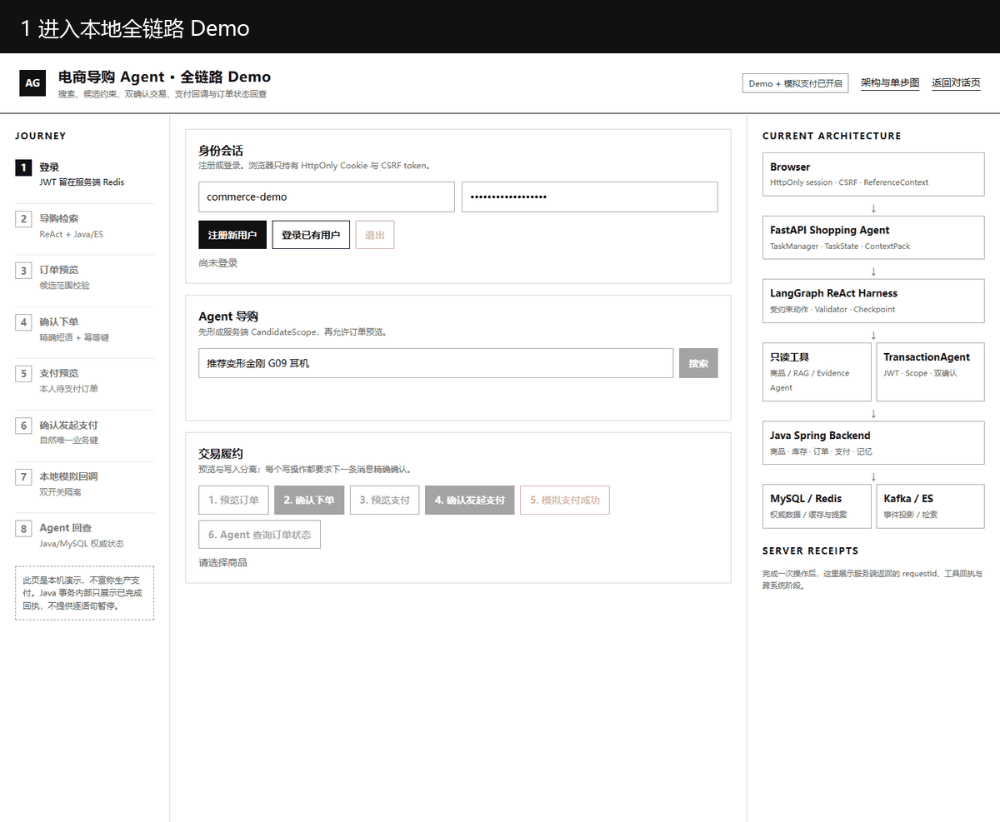
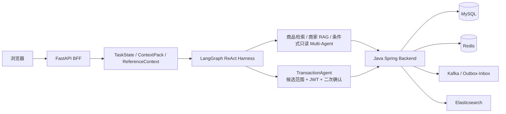

# 电商导购 Agent 与 Java 交易后端

这是一个可运行的全栈电商 Agent 工程：Python/FastAPI 负责多轮导购、上下文与受约束 ReAct，Java/Spring Boot 负责身份、商品、库存、订单、支付和事件一致性。高风险写操作不交给模型自由决定，而是经过服务端候选范围校验、JWT 身份校验、精确二次确认与幂等交易接口。

- 公开仓库：<https://github.com/Osir1603644274/ecommerce-shopping-agent>
- 演示说明：[全链路演示材料](docs/demo/README.md)



## 可运行主链



当前 Demo 已打通：

`登录 → Agent 检索 → 选择商品 → 订单预览 → 确认下单 → 支付预览 → 确认发起支付 → 本地模拟回调 → Agent 回查 PAID`

- 页面：`http://127.0.0.1:8000/commerce-demo`
- 架构与单步图：`http://127.0.0.1:8000/agent-flow`
- Java 内部事务只展示服务端回执；前端单步调试只控制只读 DebugTurn，不伪装成可逐语句暂停 Java 事务。

## 30 分钟启动

需要 Docker Desktop、PowerShell 7（`pwsh`）和可用的 DeepSeek API Key。

```powershell
Copy-Item .env.example .env
# 仅在本机 .env 中填写 DEEPSEEK_API_KEY，不要提交 .env
pwsh -NoProfile -File .\scripts\commerce-demo.ps1 start
pwsh -NoProfile -File .\scripts\commerce-demo.ps1 health
pwsh -NoProfile -File .\scripts\commerce-demo.ps1 smoke
```

结束演示：

```powershell
pwsh -NoProfile -File .\scripts\commerce-demo.ps1 stop
```

脚本只停止由本次启动登记的容器，不删除数据卷。交易、支付模拟和 Demo BFF 均默认关闭，只由该脚本在本地演示进程中显式开启。

## 仓库边界

| 目录 | 责任 | 发布边界 |
|---|---|---|
| `agent/app` | FastAPI、TaskState、Context、ReAct Harness、工具与 TransactionAgent | 生产运行时代码 |
| `backend/src` | Spring Boot 模块化单体、MySQL/Redis/Kafka/ES、交易履约 | 默认 Java 后端 |
| `backend-gateway/src` | Spring Cloud Gateway 有界拆分实验 | 非默认部署 |
| `agent/evaluation`、`evaluation` | runner、冻结场景与实验产物 | 不被生产运行时反向依赖 |
| `retrieval_judgment_pool_*` | 检索候选池 Skill/MCP 的确定性核心与本地协议层 | 独立工具链 |
| `docs/legacy`、旧兼容接口 | 本地生活与历史 RAG 路线 | `EVIDENCE_ONLY`，不进入当前自动路由 |

建议按以下顺序阅读，十分钟即可建立项目全貌：

1. [公开仓库与运行指南](docs/PUBLIC_REPOSITORY_GUIDE.md)
2. [当前架构图](docs/diagrams/current-architecture/README.md)
3. [功能—源码—测试—证据索引](docs/FEATURE_EVIDENCE_INDEX.md)
4. [本轮 Demo 与公开治理自审](docs/acceptance/commerce-demo-and-public-repository-governance-2026-09-03.md)
5. [GitHub 发布与演示验收](docs/acceptance/github-publication-and-demo-2026-09-03.md)

## 验证

```powershell
python -m pytest -q agent/tests/test_commerce_demo_api.py agent/tests/test_transaction_agent_api.py agent/tests/test_transaction_agent_runtime.py agent/tests/test_chat_endpoint.py
python scripts/check_repository_hygiene.py
python scripts/check_markdown_links.py
pwsh -NoProfile -File .\scripts\verify_project_governance.ps1
```

生成不包含本地密钥、缓存、原始外部数据、sealed 评测或历史工作包的公开候选快照：

```powershell
pwsh -NoProfile -File .\scripts\build-public-snapshot.ps1
python .\scripts\check_public_snapshot.py .\.runtime\public-snapshot-v13
```

## 诚实边界

- 当前验收证明本机单实例、真实 Agent→Java→MySQL 全链路可运行，不等于生产支付、跨系统 Exactly-once 或多机生产就绪。
- MySQL 是交易权威；Redis 用于会话、提案、缓存和幂等状态；Elasticsearch 是可重建的派生检索索引。
- Context、长期记忆、Multi-Agent、Skill/MCP 和 Spring Cloud 的具体结论必须按各自证据包表述，不能由单个 Demo 外推。
- GitHub 只发布经过允许列表复制与独立安全校验的公开快照；受保护的本地工作树、密钥、原始数据和 sealed 证据不在远程仓库中。
