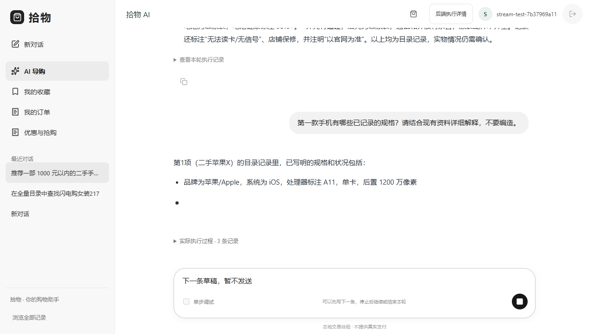
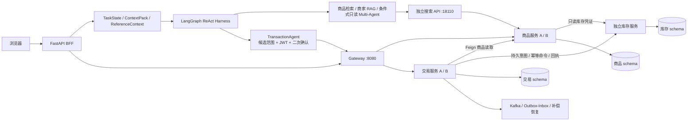

# 电商搜索推荐与购物 Agent

> **2026-09-17 源码与实验更新**：包含 React 前端、Agent、Java 商品/交易/库存服务及搜索推荐实验代码。先读 [项目审阅纲要](docs/project-review-20260917/PROJECT_OVERVIEW.md) 与 [最新行为排序实验](docs/experiments/behavior-lambdamart-20260917/SUMMARY.md)。外部数据、模型权重和本机发布清单需按文档另行准备。

**数据与评测入口：[我的数据集与 Benchmark](datasets/README.md)** — [完整资产总账](datasets/ASSETS.md)含商品、单轮、多轮 Agent、跨会话记忆和外部历史材料；[全部位置](datasets/ALL_LOCATIONS.md)可查跨盘来源与候选。

这是一个可运行的全栈电商 Agent 工程：Python/FastAPI 负责多轮导购、上下文与受约束 ReAct，Java/Spring Boot 负责身份、商品、库存、订单、支付和事件一致性。高风险写操作不交给模型自由决定，而是经过服务端候选范围校验、JWT 身份校验、精确二次确认与幂等交易接口。

- 公开仓库：<https://github.com/Osir1603644274/ecommerce-shopping-agent>
- 演示说明：[全链路演示材料](docs/demo/README.md)



当前界面以聊天为中心，支持正文 SSE 增量、停止与继续、历史回看；商品交易与后端学习详情按需展开。[流式输出与页面验收](docs/architecture/chat-streaming-20260915/ACCEPTANCE.md)。
此前版本的[全链路演示录像](docs/assets/demo/commerce-demo-walkthrough.gif)保留作历史材料，界面以当前截图为准。

## 可运行主链

日常使用统一购物页 **http://127.0.0.1:5173/**。在本机已有验收环境执行
`pwsh -File scripts/unified-commerce.ps1 start`，用 `health` 检查真实链路。
当前已选部署为 **5173 前端 → 8000 Agent → 8080 Gateway → 商品 / 交易服务**；全量商品检索由独立 **18110 搜索 API** 执行，库存由独立服务处理。
正式迁移保留 **7,637,043 条商品**及原有订单 ID，439 款二手手机继续可用。模拟售价独立于数据集原始报价，模拟库存不代表真实商家库存，重启不重新初始化库存。旧 18000/18083 不再作为日常运行入口。
商品、交易分别运行两个 Java 实例；库存独立部署、独立命令回执。三个业务所有者使用不同 MySQL schema 和 DML 账号，不能跨库直接读写。它们仍共用一台物理 MySQL，**不宣称多机高可用**。实现与验收见 [微服务发布记录](docs/architecture/microservices-release-20260915/RELEASE.md)。
本轮新增取消、按数量退款和履约回查，详见 [合并验收记录](docs/acceptance/merged-commerce-2026-09-09.md)。



当前 Demo 已打通：

`登录 → Agent 检索 → 选择商品 → 订单预览 → 确认下单 → 支付预览 → 确认发起支付 → 本地模拟回调 → Agent 回查 PAID`

- 日常购物页：`http://127.0.0.1:5173/`
- 旧全链路调试页（保留兼容）：`http://127.0.0.1:8000/commerce-demo`
- 架构与单步图：`http://127.0.0.1:8000/agent-flow`
- Java 内部事务只展示服务端回执；前端单步调试只控制只读 DebugTurn，不伪装成可逐语句暂停 Java 事务。

## 已验收本机环境启动

```powershell
pwsh -NoProfile -File .\scripts\merged-commerce.ps1 start
pwsh -NoProfile -File .\scripts\merged-commerce.ps1 health
```

该入口读取本机发布清单，恢复选中的独立服务、Agent 和前端；不自动导入百万商品，不覆盖已有数据库，也不回退到旧单体。发布清单、服务凭证和原始数据均不进入公开仓库。其他机器不能仅复制此命令便获得相同的全量数据环境。

## 小规模兼容 Demo 启动

需要 Docker Desktop、PowerShell 7（`pwsh`）和可用的 DeepSeek API Key。

```powershell
Copy-Item .env.example .env
# 仅在本机 .env 中填写 DEEPSEEK_API_KEY，不要提交 .env
pwsh -NoProfile -File .\scripts\commerce-demo.ps1 start
pwsh -NoProfile -File .\scripts\commerce-demo.ps1 health
pwsh -NoProfile -File .\scripts\commerce-demo.ps1 smoke
```

结束演示：

```powershell
pwsh -NoProfile -File .\scripts\commerce-demo.ps1 stop
```

脚本只停止由本次启动登记的容器，不删除数据卷。交易、支付模拟和 Demo BFF 均默认关闭，只由该脚本在本地演示进程中显式开启。

## 仓库边界

| 目录 | 责任 | 发布边界 |
|---|---|---|
| `agent/app` | FastAPI、TaskState、Context、ReAct Harness、工具与 TransactionAgent | 生产运行时代码 |
| `backend/src` | Spring Boot 商品 / 交易角色，Feign、MySQL/Redis/Kafka、交易履约 | 同一构建产物，独立角色 JVM 与数据库权限；保留单体兼容配置 |
| `backend-gateway/src` | Spring Cloud Gateway 路由、鉴权与双实例分流 | 当前选中部署的统一 Java 入口 |
| `backend-inventory/src` | 库存命令、回执、预占 / 确认 / 释放 / 退款 | 独立构建与库存 schema |
| `agent/app/catalog_search_server.py` | 带内部鉴权的独立检索 API | 搜索进程独立，Agent 不再承载该检索 worker |
| `agent/evaluation`、`evaluation` | runner、冻结场景与实验产物 | 不被生产运行时反向依赖 |
| `retrieval_judgment_pool_*` | 检索候选池 Skill/MCP 的确定性核心与本地协议层 | 独立工具链 |
| `docs/legacy`、旧兼容接口 | 本地生活与历史 RAG 路线 | `EVIDENCE_ONLY`，不进入当前自动路由 |

建议按以下顺序阅读，十分钟即可建立项目全貌：

1. [公开仓库与运行指南](docs/PUBLIC_REPOSITORY_GUIDE.md)
2. [当前架构图](docs/diagrams/current-architecture/README.md)
3. [功能—源码—测试—证据索引](docs/FEATURE_EVIDENCE_INDEX.md)
4. [本轮 Demo 与公开治理自审](docs/acceptance/commerce-demo-and-public-repository-governance-2026-09-03.md)
5. [GitHub 发布与演示验收](docs/acceptance/github-publication-and-demo-2026-09-03.md)

## 验证

```powershell
python -m pytest -q agent/tests/test_commerce_demo_api.py agent/tests/test_transaction_agent_api.py agent/tests/test_transaction_agent_runtime.py agent/tests/test_chat_endpoint.py
python scripts/check_repository_hygiene.py
python scripts/check_markdown_links.py
pwsh -NoProfile -File .\scripts\verify_project_governance.ps1
```

生成不包含本地密钥、缓存、原始外部数据、sealed 评测或历史工作包的公开候选快照：

```powershell
pwsh -NoProfile -File .\scripts\build-public-snapshot.ps1
python .\scripts\check_public_snapshot.py .\.runtime\public-snapshot-v13
```

## 诚实边界

- 当前已验证同机独立服务、商品 / 交易双实例，以及实际进程中断和库存回包丢失场景；这不等于生产支付、跨系统 Exactly-once 或多机生产就绪。搜索、库存和物理 MySQL 仍存在单点。
- MySQL 是交易权威；Redis 用于会话、提案、缓存和幂等状态；Elasticsearch 是可重建的派生检索索引。
- Context、长期记忆、Multi-Agent、Skill/MCP 和 Spring Cloud 的具体结论必须按各自证据包表述，不能由单个 Demo 外推。
- GitHub 只发布经过允许列表复制与独立安全校验的公开快照；受保护的本地工作树、密钥、原始数据和 sealed 证据不在远程仓库中。
