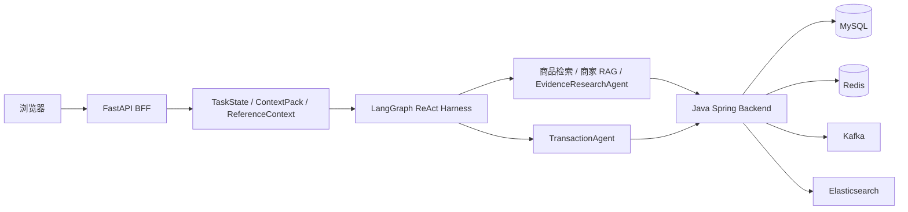

# 电商导购 Agent 与 Java 交易后端

一个面向电商导购场景的全栈 Agent 项目。Python/FastAPI 负责多轮对话、商品检索、上下文管理和工具编排，Java/Spring Boot 负责用户身份、商品、库存、订单、支付及事件处理。

[演示指南](docs/demo/README.md) · [系统架构](docs/diagrams/current-architecture/README.md) · [功能与代码索引](docs/FEATURE_MAP.md) · [测试与评测](docs/TESTING.md)


## 核心能力

- **多轮导购**：支持自然语言搜索、条件追问、商品比较、指代解析和推荐解释。
- **Agent 编排**：以 LangGraph 管理状态与 Checkpoint，ReAct Harness 负责动作校验、工具权限、执行预算、循环检测和异常回退。
- **检索与 RAG**：组合 Elasticsearch、结构化过滤、确定性重排及商家评论 RAG，并提供独立的候选池 Skill/MCP 工具。
- **上下文与记忆**：TaskState 保存任务事实，ContextPack 控制模型输入，ReferenceContext 绑定页面中的商品序号与焦点；长期偏好经用户确认后写入。
- **安全交易**：模型只生成交易提案；Java 后端完成 JWT 校验、库存检查、二次确认、幂等下单和订单归属校验。
- **后端可靠性**：使用 Redis Lua、MySQL 事务、Outbox/Inbox、Kafka、Elasticsearch 投影、Caffeine+Redis 两级缓存和接口限流。

## 系统架构



完整演示流程：

`登录 → Agent 检索 → 选择商品 → 订单预览 → 确认下单 → 支付预览 → 确认支付 → 本地模拟回调 → Agent 查询订单状态`

交易写入始终由 Java 服务处理。浏览器中的单步调试页用于查看 Agent 的任务状态、上下文、决策和工具调用；Java 事务在交易页面中以接口回执展示。

## 技术栈

| 模块 | 技术 |
|---|---|
| Agent | Python、FastAPI、LangGraph、ReAct、MCP |
| Java 后端 | Java 17、Spring Boot、Spring Security、MyBatis、Spring Cloud |
| 数据与中间件 | MySQL、Redis、Kafka、Elasticsearch、Caffeine |
| 工程化 | Docker Compose、pytest、JUnit、GitHub Actions |

## 本地运行

需要 Docker Desktop、PowerShell 7（`pwsh`）和可用的 DeepSeek API Key。

```powershell
Copy-Item .env.example .env
# 仅在本机 .env 中填写 DEEPSEEK_API_KEY
pwsh -NoProfile -File .\scripts\commerce-demo.ps1 start
pwsh -NoProfile -File .\scripts\commerce-demo.ps1 health
pwsh -NoProfile -File .\scripts\commerce-demo.ps1 smoke
```

打开本地页面：

- 导购与交易：`http://127.0.0.1:8000/commerce-demo`
- 架构与单步调试：`http://127.0.0.1:8000/agent-flow`

结束演示：

```powershell
pwsh -NoProfile -File .\scripts\commerce-demo.ps1 stop
```

启动脚本会开启本地 Demo 所需的交易和支付模拟配置，并且只停止本次启动的容器，不删除数据卷。

## 测试

```powershell
python -m pytest -q agent/tests/test_commerce_demo_api.py agent/tests/test_transaction_agent_api.py agent/tests/test_transaction_agent_runtime.py agent/tests/test_chat_endpoint.py
python scripts/check_repository_hygiene.py
python scripts/check_markdown_links.py
```

检索、上下文、Checkpoint、Multi-Agent 和 Java 并发测试的设计与结果见[测试与评测](docs/TESTING.md)。

## 项目结构

| 目录 | 内容 |
|---|---|
| `agent/app` | FastAPI、TaskState、Context、ReAct Harness、工具和 TransactionAgent |
| `agent/tests` | Agent、上下文、交易及接口测试 |
| `agent/evaluation` | 检索、上下文、Checkpoint 与 Multi-Agent 评测程序 |
| `backend/src` | Spring Boot 模块化单体及交易实现 |
| `backend-gateway/src` | Spring Cloud Gateway 与服务拆分实验 |
| `retrieval_judgment_pool_*` | 检索候选池的确定性内核和本地 MCP 服务 |
| `docs` | 架构、Demo、测试说明和截图 |

## 当前状态

项目已支持本地完整演示，支付环节使用模拟回调。公网部署、真实支付渠道和多节点部署将在后续版本中继续完善。
