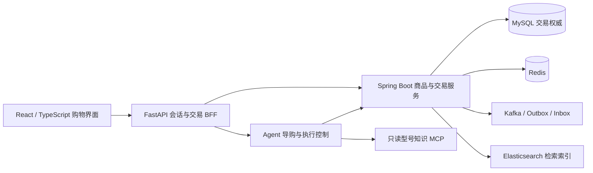

# 拾物 · AI 导购与 Java 交易平台

面向电商导购与交易的个人项目：Agent 理解需求、检索商品并组织有来源的回答，Java 后端负责身份、库存、订单、支付与事件处理。交易必须经过服务端校验和用户明确确认。

[最新界面与演示](docs/demo/README.md) · [公开源码功能索引](docs/FEATURE_MAP.md) · [测试与评测](docs/TESTING.md)

## 最新界面 · 2026-09-09 本地验收

以聊天为主入口，整合商品推荐、收藏、下单支付和订单查询；React + TypeScript 前端连接统一的 FastAPI Agent 与 Spring Boot 交易后端。


- **问询到订单**：导购 → 选择商品 → 预览并确认下单 → 本地模拟支付 → 查询本人订单；收藏、取消、退款和履约状态在同一入口中操作或查看。
- **有来源的推荐**：知识 MCP 检索型号资料，商品卡展示对应型号、适用版本和来源。没有续航实测时明确说明，电池容量不等于续航结论。
- **可查看的执行过程**：点击真实流程节点查看状态、耗时及工具/MCP 调用概要。默认连续运行，可在发起前选择单步调试。
- **暂停与恢复**：运行中请求安全检查点暂停，再从原任务继续；已验证刷新页面、暂停后服务重启、执行中进程退出后的恢复。
- **Java 交易约束**：身份与资源归属校验、精确二次确认、幂等处理和未决状态回查；不会将网络超时直接当作交易失败重新下单。

> 版本说明：以上截图与能力来自 **2026-09-09 最新本地整合版**。本次 GitHub 更新的是展示材料；当前公开可运行源码仍对应 **2026-09-03 基线**，尚不包含新版 React 目录。下方启动方式复现的是公开基线，不是截图中的新版页面。完整整合源码需单独完成公开发布审计。

### 知识来源与执行流程

| 对应型号的资料与来源 | 实际阶段及 MCP 调用详情 |
| --- | --- |
|  |  |

知识资料不能证明卖家实物机况。演示使用本地模拟报价和库存，不代表真实商品售价、库存或支付渠道。

## 职责边界



上图对应最新本地整合版。Agent 负责提出建议和交易请求，Java 保持库存、订单和支付状态的权威；前端不自行决定交易结果。

## 公开源码阅读

| 目录 | 内容 |
| --- | --- |
| `agent/app` | FastAPI、TaskState、Context、ReAct Harness、工具及 TransactionAgent |
| `backend/src` | Spring Boot 模块化单体及交易实现 |
| `backend-gateway/src` | Gateway 与有界服务拆分实验，非默认部署 |
| `agent/tests`、`agent/evaluation` | 接口、状态、交易测试与离线评测程序 |
| `retrieval_judgment_pool_*` | 检索候选池内核及独立 MCP 工具；不等同于新版在线型号知识服务 |

[公开源码架构说明](docs/diagrams/current-architecture/README.md)保留基线版本的结构与复现入口。

## 运行当前公开基线

需要 Docker Desktop、PowerShell 7 和可用的 DeepSeek API Key。不要提交本机密钥。

```powershell
Copy-Item .env.example .env
# 仅在本机 .env 中填写 DEEPSEEK_API_KEY
pwsh -NoProfile -File .\scripts\commerce-demo.ps1 start
pwsh -NoProfile -File .\scripts\commerce-demo.ps1 health
pwsh -NoProfile -File .\scripts\commerce-demo.ps1 smoke
```

基线页面：`http://127.0.0.1:8000/commerce-demo`；调试页：`http://127.0.0.1:8000/agent-flow`。

```powershell
pwsh -NoProfile -File .\scripts\commerce-demo.ps1 stop
```

脚本只停止登记的容器，不删除数据卷。最新本地版的 5173 启动命令暂不作为公开源码的复现说明。

## 验证与限制

最新整合版已完成本机浏览器下单、丢回执回查、本地模拟支付、本人订单查询，以及两种进程恢复检查；具体边界见[演示与验证说明](docs/demo/README.md)。

当前公开源码可执行：

```powershell
python -m pytest -q agent/tests/test_commerce_demo_api.py agent/tests/test_transaction_agent_api.py agent/tests/test_transaction_agent_runtime.py agent/tests/test_chat_endpoint.py
python scripts/check_repository_hygiene.py
python scripts/check_markdown_links.py
```

本项目不宣称真实支付、生产容量、任意故障下无损恢复或跨系统 Exactly-once。未发布的本地测试结果不等于当前公开提交的 CI 结果；密钥、业务数据、模型缓存和封存评测不随展示材料上传。
