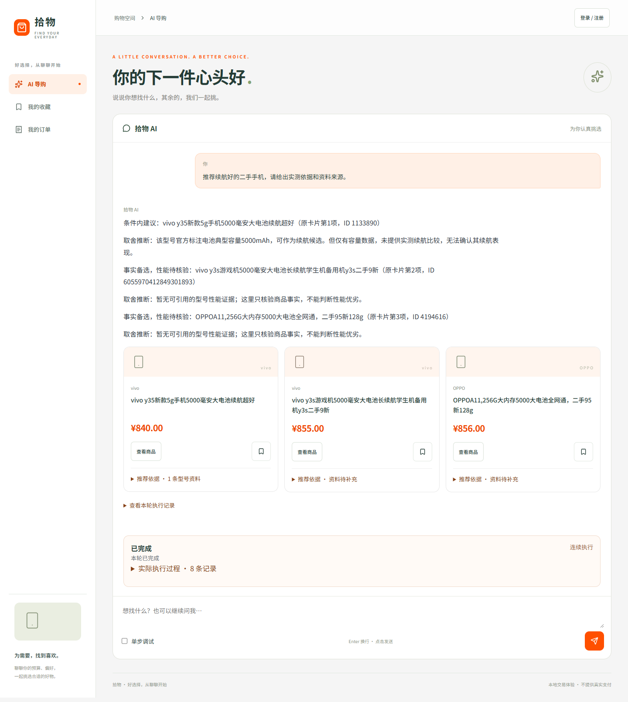
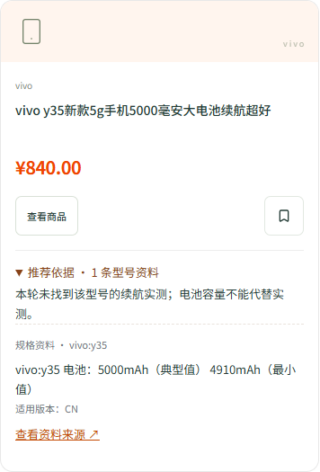
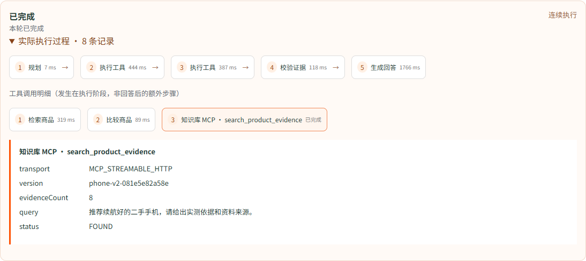
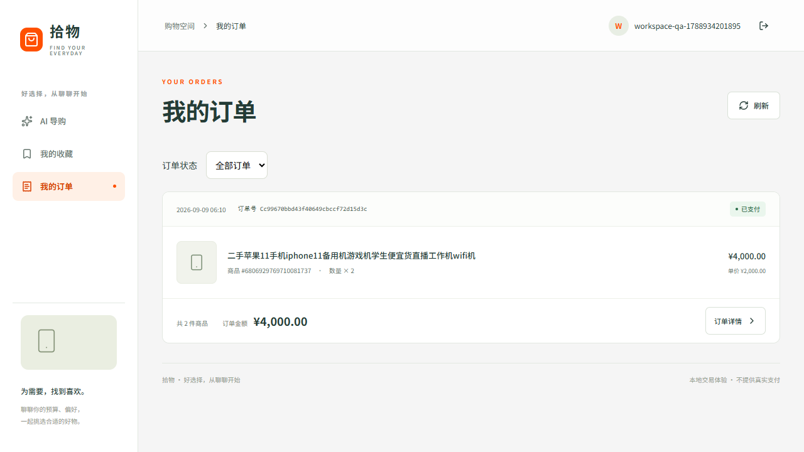

# 最新购物界面与演示

更新日期：2026-09-09。这里展示最新本地整合版的真实浏览器截图，不是设计稿或虚构交易页面。

**版本边界：本次仅更新 GitHub 展示材料，公开源码仍是 2026-09-03 基线；新版 React、整合运行配置及相关服务改动尚未完成整体源码发布。**

## 聊天导购

统一入口中完成问询、商品推荐、收藏和交易。正文分段展示；商品卡保持与回答一致，不将其他型号的参数作为当前商品证据。

## 知识资料

下图为实际返回的型号规格与来源。缺少续航实测时只提供已取得的规格，不以电池容量推断续航排名；型号规格不能证明这台二手机的电池健康或实物机况。

## 执行流程、单步与暂停

默认连续执行；发送前可勾选单步调试。节点详情展示真实阶段、耗时与允许公开的工具记录，知识 MCP 明细来自实际调用，不展示内部思维链。

暂停等待当前工具结束并保存检查点，随后继续原任务；不是强制冻结网络请求，也不撤销已完成的工具。暂停后修改需求须明确结束本轮。

## 下单与订单回查

浏览器回归实际执行了注册、导购、收藏、数量为 2 的下单、丢回执回查、本地模拟支付和本人订单查询。测试业务记录保留，没有通过清表或回填库存伪造结果。

## 本地验收摘要

| 检查 | 结果与限制 |
| --- | --- |
| Python 控制、工作空间、调试、知识及图恢复定向测试 | 78 项通过；不是当前 GitHub 基线的测试次数 |
| 前端单元测试、类型检查和构建 | 24 项通过，构建通过 |
| 浏览器购物页面模拟回归 | 6 项通过 |
| 实际浏览器购物链路 | 下单、回查、本地模拟支付和本人订单通过 |
| 实际浏览器控制链路 | 连续暂停/刷新/继续、单步/刷新通过 |
| 暂停后重启进程、执行中退出进程 | 两种场景均保留原 runId，恢复后最终回答各 1 条 |

上述是本机整合测试，不是线上服务、多机容灾或性能基准。当前整合页在本轮结束后整体显示回答，尚不逐 token 流式显示。数据库、密钥和含会话凭据的浏览器 trace 不公开。

## 公开基线的复现

当前 GitHub 源码使用[首页中的基线启动命令](../../README.md#运行当前公开基线)，打开 `http://127.0.0.1:8000/commerce-demo`。它与上面的新界面不同，请勿把 5173 地址当作公开在线演示。

[2026-09-03 历史演示动图](../assets/demo/commerce-demo-walkthrough.gif)保留作为旧版证据，不再作为首页主图。
