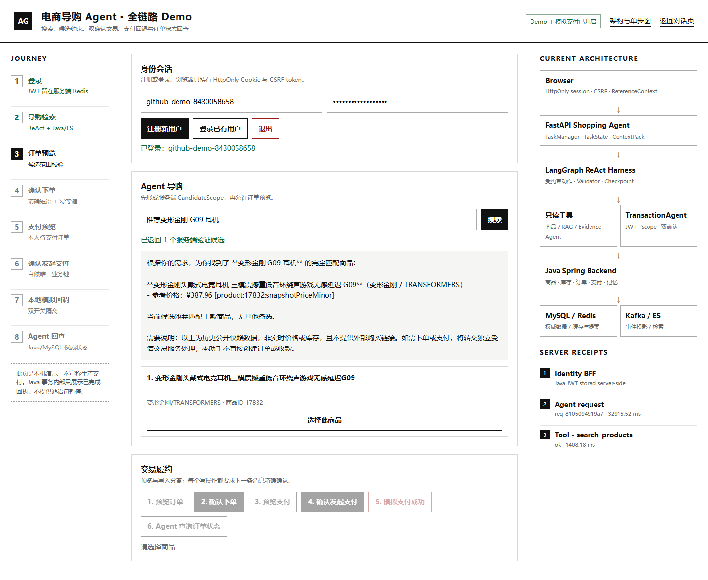
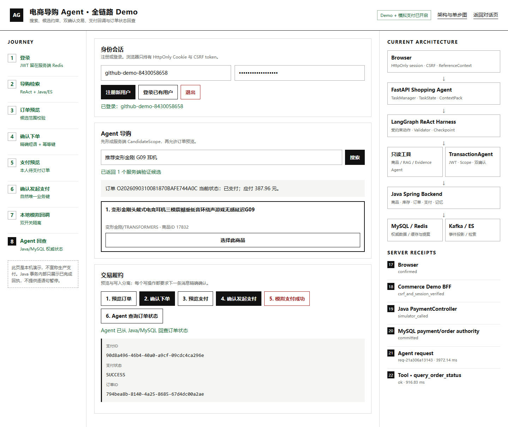

# 本地全链路 Demo

演示覆盖以下流程：

`注册 → Agent 检索 → CandidateScope → 订单预览 → 确认下单 → 支付预览 → 确认支付 → 本地回调 → Agent 回查 PAID`


## 运行

```powershell
Copy-Item .env.example .env
# 仅在本机 .env 填写 DEEPSEEK_API_KEY
pwsh -NoProfile -File .\scripts\commerce-demo.ps1 start
pwsh -NoProfile -File .\scripts\commerce-demo.ps1 health
```

打开：

- `http://127.0.0.1:8000/commerce-demo`
- `http://127.0.0.1:8000/agent-flow`

结束后执行：

```powershell
pwsh -NoProfile -File .\scripts\commerce-demo.ps1 stop
```

## 界面预览





最终页面显示支付状态 `SUCCESS`，Agent 从 Java/MySQL 查询到订单状态 `PAID`。支付步骤使用本地模拟回调，不连接真实支付渠道。
