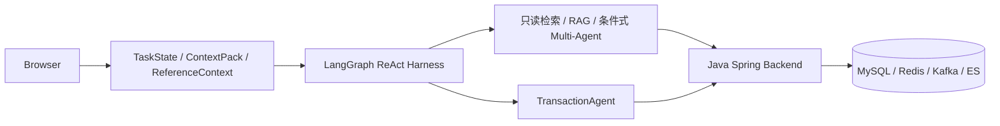

# 当前架构图

更新时间：2026-09-03。当前事实以源码、运行时读回和证据索引为准。

## 当前入口

- `current-system.mmd`：Agent→Java→数据面的简明 Mermaid 源。
- `/agent-flow`：生产 `react_v1` 参考图、真实只读 DebugTurn 单步记录与节点代码映射。
- `/commerce-demo`：搜索、双确认交易、支付回调和订单状态回查。

## 单步调试边界

前端单步图读取服务端 `DebugTurn revision`，展示 TaskManager、TaskState、ContextPack、决策、Executor、Validator、修正和 FinalAnswer。该链路用于只读调试，保留 PAE 兼容阶段名；生产默认仍是 LangGraph durable 上的受约束 ReAct。

交易写入不进入 DebugTurn。Java 事务只在交易 Demo 中展示接口级回执，不能由浏览器逐节点暂停，也不能把 MySQL 语句伪装成 Agent 节点。

## 历史图册

`10`–`14` 与 `00`–`05` 是旧代码审计快照，保留为 `EVIDENCE_ONLY`。其中 PAE/Planner/Replanner 图不再代表当前生产默认架构。

完整源码、测试和证据映射见 [功能—源码—测试—证据索引](../../FEATURE_EVIDENCE_INDEX.md)。
