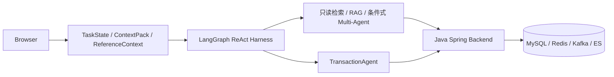

# 当前架构图

## 页面入口

- `current-system.mmd`：Agent→Java→数据面的简明 Mermaid 源。
- `/agent-flow`：ReAct 执行图、只读 DebugTurn 单步记录与节点代码映射。
- `/commerce-demo`：搜索、双确认交易、支付回调和订单状态回查。

## 单步调试

前端单步图读取服务端 `DebugTurn revision`，展示 TaskManager、TaskState、ContextPack、决策、Executor、Validator、修正和 FinalAnswer。部分阶段名来自早期 PAE 版本，当前 Agent 使用 LangGraph 上的受约束 ReAct。

DebugTurn 只记录 Agent 调试信息。Java 事务在交易 Demo 中以接口回执展示，不支持通过浏览器逐语句暂停。

完整源码与测试位置见[功能与代码索引](../../FEATURE_MAP.md)。
