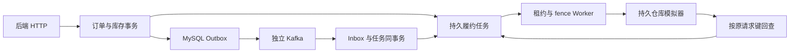

# 后端强化 V1：最终结果

- 日期：2026-09-04；结论：`BOUNDED_BACKEND_STRENGTHENING_ACCEPT / HOLD_PRODUCTION_DEFAULT`。
- 后端已独立于 Agent 验证：JDK 17 常规测试 **216/216**，真实 MySQL/Kafka/HTTP 交易与恢复检查 **10/10**，SQL 对照覆盖 **1 万/10 万/100 万**订单。
- 业务默认仍为模块化单体；履约登记、Worker、Kafka 三开关默认关闭。专用验证环境显式开启，无模型调用，不改 Agent/Context 源码或其运行配置。
- [`REPORT.md`](REPORT.md) 是先完成轻量验证时的阶段快照，其“等待真实验证”状态由本文及后续原件补足；阶段一原件不回填。

## 1. 实际交付

1. **订单查询**：认证游标分页、稳定排序、用户/筛选签名绑定、单页最大 100；明细批查。旧完整列表接口保留响应合同，按 200 单批量取明细。
2. **可靠履约**：下单事务登记任务；专用 Kafka 组将 Inbox 和本地状态同事务提交，之后 ACK；消费失败落可重放死信。
3. **外部恢复**：不可变仓库命令、稳定幂等键、有限线程池、数据库租约与 fence；先回查再提交，未知结果退避并转人工处理。
4. **交易一致性**：退款/出库统一锁订单；禁止对出库中或未知结果直接退款。确认未出库的已登记订单退款成功后恢复库存，重复回调不重复加库存；确认收货不再扣库存。
5. **可观测与复现**：持久化尝试记录、操作者审计、Worker 队列和延迟指标、独立 Compose、持久仓库故障模拟器、真实链路验证与 SQL/HTTP 负载脚本。

普通订单范围为 `OrderService.create` 新建的 PRODUCT 订单；秒杀仍有独立订单模型，本轮未把秒杀改造成物流订单。

## 2. 真实验证与修复

| 检查 | 结果及边界 |
|---|---|
| V15 迁移 | MySQL 8.4 中通过；首次应用 15 个迁移，修复后重启再次校验通过 |
| 退款先赢 | Worker 关闭期间支付/退款，任务取消；随后启用 Worker，仍无出库 |
| 支付→消息→出库→收货 | 真实 HTTP、Outbox、Kafka、Inbox、MySQL、仓库 SQLite 串联通过；重复支付事件不重复履约 |
| MySQL 事务回滚 | 在专用库用触发器拒绝 Outbox 插入：订单、库存、履约任务一起回滚；触发器随后移除 |
| 提交后丢响应 | 仓库持久提交后断开连接；两次 Worker 尝试完成回查，实际出库记录 1 条 |
| 未知结果与人工重试 | 预算耗尽进入 NEEDS_REVIEW；退款 409、普通用户重试 403；管理员沿原请求键恢复 |
| 真实进程强退 | 仓库提交后、任务仍 DISPATCHING 时 SIGKILL 专用后端；重启后 fence 1→2，回查完成，出库仍为 1 条 |
| Kafka 毒消息 | 初次＋3 次重试后持久落死信，并核验 consumer group 的已提交 offset 越过该消息 |
| MySQL 管理员重放 | 向专用库写入明确标注的死信 fixture 后，从 HTTP 重放；保留原死信，重新验证事件身份 |
| MySQL HTTP 游标遍历 | 本次账号 5 单，2 条一页完整遍历，无重复遗漏 |

**实际修复了一个原有遗漏**：首次真实链路 `real-chain-attempt001` 中，未出库退款后库存仍为 `available=497,sold=3`，预期为 `498,2`。随后增加 `CONFIRMED→REFUNDED` 库存预占记录条件转移，并把库存恢复纳入退款事务；修复后 `real-chain-attempt002` 的库存检查、重复退款回调和其余检查全部通过。旧失败及旧 JAR 保留，未重跑覆盖。

库存自动恢复只适用于已登记履约且确认 CANCELLED 的订单。老订单没有“未出库”证明，保留原合同，不推定可以自动归还库存。

## 3. 查询证据

每组先预热，交替运行 10 对相同 20 单的查询；完整订单/明细摘要一致。微基准产生相同页内容，比较 N+1 和批查；生产分页另外多取 1 单判断 `hasMore`。本表是 SQL 微基准，不是整站性能或旧完整列表接口的 HTTP 加速比。

| 总订单数 | N+1 SQL 次数 | 批查 SQL 次数 | N+1 中位 ms | 批查中位 ms |
|---:|---:|---:|---:|---:|
| 10,000 | 21 | 2 | 28.044 | 4.480 |
| 100,000 | 21 | 2 | 27.470 | 4.857 |
| 1,000,000 | 21 | 2 | 24.207 | 4.148 |

重用户持有各数据集的一半订单，含相同时间戳。深页与 OFFSET 参考页内容一致，真实 EXPLAIN ANALYZE 使用现有 `idx_customer_order_user_created` 范围扫描；本轮未增加重复索引。各规模为独立数据库，数据与结果目录保留。

同一物理机仍有 Context 工作；两个 SQL 实现按同页配对，仅作本机描述性证据。状态筛选的不同选择率、冷热用户分布和长期并发尚需更完整负载。

## 4. HTTP 分页负载

专用后端限制 1 CPU/1 GiB，MySQL 1 CPU/768 MiB；导入 1 万条仅供读取的历史订单。
Python HTTP 客户端复用连接，按 1/4/8 并发依次各运行约 10 秒，共 **4,703 请求，0 错误**。

| 并发 | 请求数 | 观测请求/秒 | P50 ms | P95 ms | P99 ms |
|---:|---:|---:|---:|---:|---:|
| 1 | 694 | 69.40 | 8.60 | 54.51 | 65.42 |
| 4 | 1,698 | 168.74 | 8.45 | 79.19 | 85.29 |
| 8 | 2,311 | 231.10 | 9.34 | 88.63 | 91.76 |

这是同机短时 HTTP 负载观察，包含鉴权、数据库和网络成本；各阶段按固定次序执行，JIT/缓存和同机其他任务未控制，不能据此认定生产容量或并发扩展收益。未执行 k6，也未把 SQL 微基准数字写成 HTTP 加速比。
逐请求数据位于 `real-evidence/http-attempt001`（本地材料：`real-evidence/http-attempt001`），前后资源快照随证据保留。

## 5. 证据与复现

- `real-evidence/validation.json`（本地材料：`real-evidence/validation.json`）：216 项常规测试汇总、10 项真实链路及负载结果。
- `real-evidence/java17-final-reports`（本地材料：`real-evidence/java17-final-reports`）：JDK 17.0.19、Maven 3.9.16 的常规 Surefire 原件；`package` 全部通过。它不包括另由 Failsafe 运行的既有 `*ContainerIT`，网关也未在本轮重跑。
- `real-evidence/real-chain-attempt002`（本地材料：`real-evidence/real-chain-attempt002`）：真实接口轨迹、任务/Inbox/尝试/死信回查、Kafka offset 证据。
- `real-evidence/real-chain-attempt001`（本地材料：`real-evidence/real-chain-attempt001`）：原失败保留。
- `real-evidence/manifest.json`（本地材料：`real-evidence/manifest.json`）：原件 SHA256；`real-evidence/delivery-manifest.json`（本地材料：`real-evidence/delivery-manifest.json`） 绑定本轮增量、未提交基线与实际运行 JAR。
- [`验证工具说明`](../../../scripts/backend-strengthening/README.md)：开关、端口、准备数据、注入故障与执行命令。

首次 JDK 17 构建发现跨 Windows 挂载目录扫描过慢，终止该构建并保留日志，改用容器内部源码/依赖目录。随后完整常规测试 215/215；库存修复后再次全量 216/216。阶段一 JDK 21 的 29 项定向验证与 5 项仓库测试原件继续保留，未合并成“所有环境一次通过”。

## 6. 保留边界

- 仓库是有持久幂等键和按键查询的本地模拟器，支付也是本地模拟；未对接真实物流、收件地址、退货或部分退款。
- 跨系统不宣称 exactly-once。fence 防止旧 Worker 覆盖本地结果；外部去重仍依赖仓库合同。
- 线程池有界不等于已证明生产积压恢复时限；持续进程崩溃、数据库长时间不可用和告警平台仍需后续演练。
- 新游标扫描不构成跨请求固定快照；老完整列表可能返回较大响应，调用方迁移与线上访问分布仍需跟进。
- 主项目共享服务、Agent/Context 和旧正式实验不改；未执行提交、推送或破坏性 Git 操作。
