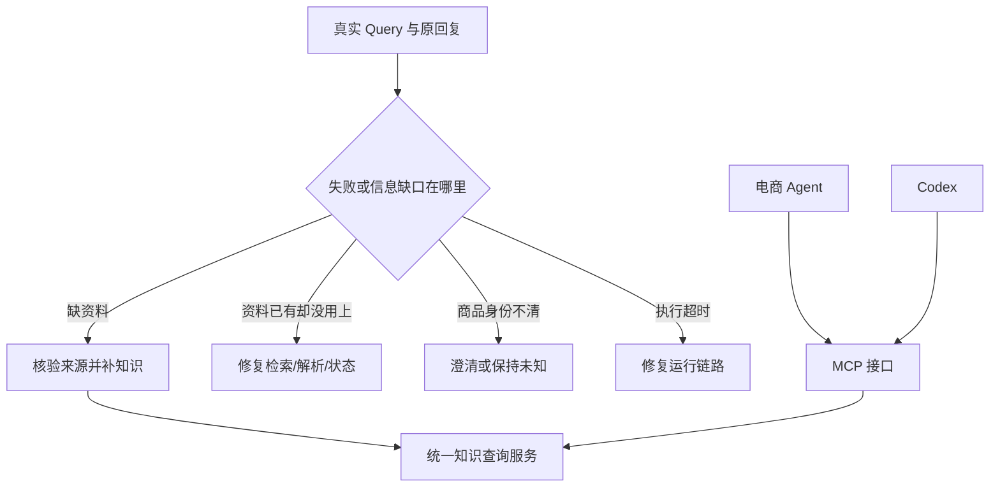

# 2026-09-07：从实际数据决定商品知识库与 MCP

- topic_id：`product-knowledge-gap-audit-v1`
- 状态：审计完成；2026-09-08 起实施知识库/MCP，完整验收未完成；学习掌握未验收。
- 原始问题、数量、SHA 与后续建议见 [数据审计](../analysis-briefs/product-knowledge-mcp-2026-09-07/README.md)。

## 发现一：关键词出现，不代表用户要求该能力

真实原文：“就是性价比高的 不怎么打游戏 也不要求拍照 其他方面质量好的”。

如果用“游戏/拍照”关键词统计需求，会将明确否定误计为正向兴趣。本轮 397 条公开 Query 只做透明的词法筛查，21 条已确认真人原文另外逐条分析；前者不冒充语义金标，后者不外推人群比例。

**记住：关键词筛查负责找值得看的样本，人工/分析复核负责解释这个样本。**

## 发现二：请求 completed，不等于问题解决

真实用户要求“续航好…先推荐我看看”，旧记录的 HTTP/intake 为 completed，实际回复却是总执行超时。若只按状态码统计，会把失败计为成功。

本轮读取两个 SQLite 共 1,020 条请求，不能说有 1,020 个真人问题。核验已有真人来源收据后只使用对应的 8 会话、21 轮作为确认样本；21/21 与原数据库行哈希和原文匹配，8 轮有原 diagnostic，其余需看逐字记录。

此例直接问题是运行故障。它可以暴露续航知识需求，但新增知识不能修复超时。

## 发现三：有标题，有属性，也可能没有足够证据

手机有电池健康字段，不等于有实际续航测试；有“1.6 亿像素”标题，不等于拍照更好。已有 5 个型号事实也只覆盖一种 WiFi 网页续航测量，不支持任意游戏、拍照或单台二手机表现。

服饰查询“没有聚酯纤维的衣服”则不同：现有属性串已有材料文字，优先问题是解析和否定过滤。商品未提聚酯纤维，不能解释为不含聚酯；需要完整成分依据。

| 问题来源 | 优先解决方式 |
|---|---|
| 缺型号参数、术语定义 | 核验来源后补知识 |
| 字段已有但没解析、预算丢失 | 修复字段解析与状态 |
| 这里面、前两个没有绑定 | 修复候选范围和指代 |
| 信息矛盾、型号不明 | 保留冲突、澄清身份 |
| 超时、网络错误 | 修复运行与恢复链路 |

## 发现四：系列名称不能充当商品身份

样本中查询有“361飞燃3et跑鞋”，但商品标题“飞燃3全掌碳板…”对应品牌字段却是“轻王”；另一项“飞燃3.0…”对应“佩与”。本轮不能判断真假，但已经足以拒绝“看到系列词就关联官方型号事实”的设计。

服饰 162 件中 136 件为“无品牌”，跑步鞋 25 件中 17 件为“无品牌”。因此多品类知识库需要容纳品类通识，不能假定所有商品都能绑定官方产品页。

## 发现五：离线数据覆盖不等于在线业务支持

代码 `ProductCategory` 当前仅为 phone/laptop/headphones。服饰和跑步鞋存在离线语料，但还没有对应的受控购物品类合同。

因此未来实现顺序需包含品类和字段接入。若只做 MCP 工具演示，不能把它写成三品类购物闭环已经完成。

## 复习问题

1. 为什么电池健康 90% 不能证明 A 型号续航优于 B 型号？
2. “没有查到聚酯纤维”与“确认不含聚酯纤维”有什么区别？
3. 为什么 MCP 工具返回成功，仍不能证明最终回答正确？
4. 从上面的真实案例中，各找一个知识问题、状态问题和运行问题。

掌握标准：能用原问题说明边界，并指出需要什么新证据或哪个工程环节；尚未进行用户答题验收。

## 2026-09-08：从“可能找得到”推进到真实来源核验

详表及逐字Query见[手机来源核查](../analysis-briefs/product-knowledge-mcp-2026-09-07/phone-sources-20260908/README.md)。本次21轮重新回连数据库；挑出7条知识需求和3条工程对照，涉及13件目录商品，核对8个外部来源。没有新跑回答实验，未证明回答改善。

1. **问题必须带原候选。**“这里面那个适合打游戏 续航好？”原指两件Mate40Pro和一件畅享20。旧回复新搜出vivo，不能据新答案反推用户原先在比较vivo。先恢复正确范围，再讨论知识缺口。
2. **不要把已有知识说成全无。**现有5条型号续航事实、22条解析切片中，两件Mate40Pro已关联609分钟网页测试。本次原网页复核为10小时9分钟、150cd/m²、Huawei Browser 11；不能当成2026年二手实物的续航保证。见[原评测](https://www.notebookcheck.net/Huawei-Mate-40-Pro-review-Top-smartphone-with-handicap.505829.0.html)。
3. **型号绑定比复制参数更重要。**原回复的A96标题含5G/骁龙695，与[中国官网PFUM10参数](https://www.oppo.com/cn/smartphones/series-a/a96/specs/)一致；不能凭记忆误判它写错芯片。另两件手机没有具体型号，仍不能补参数。荣耀80/X40目录品牌写华为，先保留冲突，不悄悄覆盖原始字段。
4. **找到页面不等于取得内容。**荣耀规格页本次提取多为空字段，改查官方帮助中心相应型号小节，才拿到相机参数；系列页面还必须排除Pro/SE内容。
5. **规格能增加解释，不能直接生成总排名。**[Find X6官网](https://www.oppo.com/cn/smartphones/series-find-x/find-x6/specs/)给出潜望长焦、OIS与光学变焦，可用于解释具体拍摄用途；仍需用户场景和可比实测支持“拍照更好”。

以上为9月8日审计时点的建议，当时尚未实施。后续用户授权全439件型号调查与实现，进度如下。

## 2026-09-09 实施中：真实问题与修复

1. **模型名初查会漏召回。**178型号共取得1991个候选链接条目，但检索会把A11返回为A1、把手机型号返回成配件兼容表。这些不是有效事实。当前只将逐页/原回执核对的25条事实入库，覆盖12型号；其余保留待核查，不能声称全量知识完成。
2. **字段名不能按旧SDK记忆写。**MCP SDK2客户端对象用`read_only_hint`等字段；工具还可能只有text结果。首次读取报错，改为按别名序列化并兼容JSON文本。原失败attempt001保留，attempt002真实HTTP验收通过。
3. **一次正确查询不等于服务可靠。**8路并发取得一致知识版本和证据；关闭测试进程后调用失败，重启后恢复同一内容。见原始结果（本地材料：`../acceptance/product-knowledge-mcp-20260908/mcp-live-attempt002/result.json`）。这些只证明组件行为，不证明购物回答质量。
4. **新工具也必须穿过旧合同。**旧Planner把工具全部输出合同合并，旧Harness把比较压成最多3件。新增合同要选择唯一形状，且保留全部候选核验结果，否则工具即使注册成功，也不能把知识正确交给父Agent。
5. **两个客户端确实走同一个服务。**购物内部客户端和Codex CLI均经Streamable HTTP查询，版本`phone-v1-879ef066937c`，同证据ID内容一致。Codex最初WebSocket请求超时，自动回落HTTPS后成功；这不是知识服务超时，不能混入MCP检索耗时。

默认功能开关仍关闭。真实21轮回归、固定模型新旧对照与全量来源核查尚未完成；不记录虚构提升率，不提高学习掌握等级。

### 9月9日后续：全量标题复审与真实运行暴露的问题

- 逐条复查439标题，修正35处：Y35+不能绑Y35，荣耀9X不能绑荣耀9，Reno4 SE不能绑Reno4，多型号混写必须记歧义。V2为明确288、冲突50、歧义89、未知12；171型号组。CLEAR仅是标题声明，不是卖家实物鉴定。V1保留但不再作为最新绑定。
- V2收录425条事实、111个来源，99/171型号有事实。其余保留实际调查记录和字段缺口。官网也会有错误：iQOO 8 Pro额定容量换算不一致，仅采典型容量；Mate XT反向充电功率前后矛盾，该项不采。没有把搜索到的页面数量算成有效来源数量。
- Python条件分支中的局部`settings`导入使函数其他路径触发变量作用域错误；移除冗余局部导入后，候选/Planner/Harness回归180项通过。
- 首次真实V2对话虽然HTTP 200，却是`planning_failed/invalid_argument_source`，没有调用任何工具。原因是仅给旧Harness注入了原始需求策略，新Graph运行时没有发布该字段；现统一在请求级GraphV2Runtime注入，Planner与Executor共用同一值。失败原件保留在`live-smoke-attempt001`，不能把200当业务成功。
- V2 MCP真实BM25/BGE、8路并发、断连恢复通过，版本`phone-v2-081e5e82a58e`。这依然不是Agent回答质量验收。

### 真实运行回归：不能只看组件测试

- `live-smoke-attempt002`暴露Executor仍把前一步引用当成空参数。修复为读取已持久化的前一步输出，并继续由Executor核验来源，不让模型补ID。
- `attempt003`的Validator输入估算177132 Token，限制10000：原始属性全文与旧比较决策重复传递。保留完整原始ToolTrace，Validator只携带当前条件需要的所有精确匹配词、候选检查摘要绑定及共享证明；不删除冲突词、不调高预算。
- 精简时遗漏categoryL1/L2/L3会使类别变成未知，已补回。复查结论是：节省Token必须核对下游真实读取字段，不能只按最终展示字段裁剪。
- `attempt006`第一轮已生成带型号证据回答；第二轮Validator仍10800/10000，继续修复重复属性元数据。后续全21轮开发回放发现最终回答在复杂预算/品牌条件下也会超过预算，以及父模型等待超过45秒总期限。失败原件全部保留，暂不启用Demo。
- 新父模型回答限定800输出Token，并沿用现有30秒最终回答超时；超时返回事实与缺口，不临时联网。这里是可靠降级，不是回答质量通过。
- 首个参数开发题发现8条证据配额被其他型号分走，导致iPhone13只见芯片不见相机。增加明确型号聚焦与问题字段过滤；缺口需区分“资料缺失”和“本轮未召回”，不能从当前上下文推断全库没有资料。
- 新增硬条件投影/冲突/否定/大整数ID测试及候选、交易边界回归，共101项通过。V2 Codex与购物MCP组件查得同版本同证据，仍不替代整条Agent链验收。

### 真实模型回执纠正了我们的判断

`parent-probe001`返回finishReason=length，prompt_tokens=7058、completion_tokens=800，其中reasoning_tokens=800，正文没有recommendations。实际配置是deepseek-v4-flash；不能以settings里的默认deepseek-chat代替运行配置。新增最终回答模式开关，在A/B两臂都固定关闭thinking和800输出Token；依据[DeepSeek官方协议](https://api-docs.deepseek.com/guides/thinking_mode/)显式传参。

新增测试后220项相关回归通过。实测仍发现“500预算说成5000”“按型号定位推测相机更强”等不合格理由：父模型输入不再包含卖家广告标题，价格由校验后程序按分转元输出，无引用的性能理由改为明确待核验。不能因为模型已经看到RAG证据就认为它一定忠于证据。

“续航好”在旧代码中自动生成battery_health高档位软偏好；新模式取消这条替代关系，保留明确的电池健康条件。型号续航、实物电池健康和用户偏好是三种信息，不应混写。

### 最终回归中的证据与状态边界

- `real-21-attempt004`仍有“电池容量/能量最大所以续航潜力最大”的理由。修复提示词与发布检查，禁止用容量、像素、芯片名称替代场景实测；未引用证据的理由不能发布为性能结论。地区不同的同型号商品也不能互用引用。
- `real-21-attempt005`21轮均完成比较，16轮呈现来源，7轮保守降级；这是流程与来源覆盖统计，不是16/21回答质量得分。Token核算最初少算TaskManager：它在Graph runId建立前绑定requestId，补齐两个索引得到旧臂5次/新臂23次真实调用；没有改写原始turns.jsonl。补充回执有原件SHA绑定。
- `development-attempt004`中“OPPO A11原神60帧”未在原检索Top20得到明确A11；第一轮拒绝其他型号代答是对的，但下一轮“没有实测也不要猜，告诉我缺少什么”丢失指定型号。为CandidateScope保存原检索query，并经受控参数来源传给知识检索；显式新型号优先于旧上下文。未命中目标型号时不展示其他手机冒充答案。原商品检索对具体型号的召回仍需单独改进，不能用知识层拒答冒充召回修复。
- `development-attempt005`新增contextQuery后被旧shopping_guide来源白名单拦住；三轮HTTP200且traceSummary.agentStatus仍为ok，但planningFailure=invalid_plan。这是实际失败，已补固定来源scopeSourceQuery并扩展端到端单测，也修正审计器读取planningFailure。字段从来源、规划、执行、验证到回答必须整条注册。
- 资料总审查439/439记录、171/171来源调查、425事实引用完整；151条非CLEAR商品逐条查询均未绑定事实。源资料的地区/软件/测试条件未知仍保留，审核不是人工金标或实物鉴定。

- `development-attempt006`流程和引用绑定检查通过，进一步逐句看回答发现模型在unknowns里说“其余19件没有实测”，但当前证据窗口不代表全库覆盖。现在缺口只渲染知识服务的结构化登记，不发布模型编写的覆盖统计；需求权衡仍由父模型完成。引用存在只证明出处能找到，不自动证明每一句推断正确。

### 覆盖不是一个数字

V2有425条事实，但分布为芯片97、电池67、相机规格85、充电83、屏幕85、续航实测8；游戏实测和拍照实测为0。99/171型号有事实，只能覆盖199/439件明确绑定商品。102个官方来源、9个独立测评来源不等于111份完整实测。这决定本版适用规格解释、有限续航证据和明确缺口，不适合包装为已完成游戏/拍照性能排名。

### 本轮收尾（9月9日）

最终代码通过223项相关测试；attempt007新旧两臂完成原21轮与新增8轮，未发现商品/引用越界、硬条件违规或原序号错误。实际21轮知识模式16轮带来源、3轮保守回退，中位3.82s；旧模式1.59s。实际总Token新136308/旧17162；不能宣传降本。开发8轮知识模式仍5轮保守回退，不作全面回答质量提升声明。

本地实验Demo已显式开启（18000），共享只读MCP为18791；通用默认开关仍false。新增开发题已登记资产总账，共33条目，未冒充正式benchmark。详情、原件与限制见../acceptance/product-knowledge-mcp-20260908/RESULT.md；机器收尾回执completion.json保存Demo状态和验收文件SHA。
