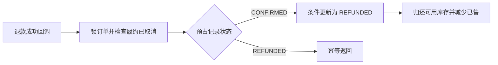
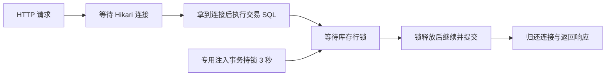
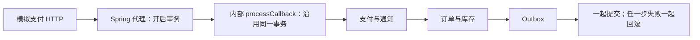

# 企业级后端补全学习日志

这份日志记录后端建设中真实发现的问题、定位过程、修复取舍和验证数据；后续学习时配合源码与原始证据逐段阅读。已提交阶段可按提交回看，未提交阶段按交付清单中的文件哈希核对。

最新记录：[2026-09-05：混合负载与数据库锁等待](#backend-mixed-workload-20260905)；上一轮为 [订单查询与可靠异步履约](#backend-strengthening-20260904)。各阶段保留各自的实现和验收快照；例如持久层工具选择、库存状态集合，应结合最新阶段和实际代码理解。

## 阅读方式

1. 先读每阶段的“业务问题”，理解为什么需要该能力。
2. 再沿“关键代码入口”阅读 Controller、Service、Repository/Mapper 和迁移脚本。
3. 运行记录的验证命令，主动制造一次失败，再观察保护机制。
4. 最后用“面试表达”中的问题复述设计取舍，不背实现细节。

### 及时记录规则（2026-09-04）

- 每轮发现、修复或得到实测数据后及时追加，不等到阶段结束或 Git 提交；未解决问题先记录现象和当前假设，验证后补充结果。
- 每项按“发现方式与现象 → 定位证据 → 原因 → 修复及取舍 → 验证数据与原件 → 待学习问题”记录，避免只有功能清单。
- 区分原有业务缺陷、开发过程错误、主动注入的故障和性能测量；失败原件保留，修复后使用新 attempt，不覆盖成成功记录。
- 数字必须附环境、规模、统计口径和适用范围；源码链接便于阅读，交付清单与原件哈希用于核对当时版本。
- 工程实现、验收结果与学习者掌握情况分别记录；原始回答和后续复习进入 [学习进度](../../review/progress.md)，测试通过不自动提高掌握等级。

## 阶段一：工程基线、Modulith、MyBatis 与 Flyway

对应提交：`9d77617 refactor(backend): establish modulith mybatis flyway baseline`

### 业务问题

- 原持久层全部依赖 `JdbcTemplate`，SQL、参数拼装和行映射混在 Repository 中，不利于后续复杂交易 SQL 和并发更新。
- 数据结构由 Compose 初始化脚本和测试 `schema.sql` 分别维护，没有可审计的生产迁移链。
- 包结构虽然按业务划分，但没有自动化规则阻止跨模块循环依赖。

### 实现

- Spring Boot 从 3.4.5 升到 3.4.13，Java 保持 17。
- 引入 Spring Modulith 1.3.12，并增加 `ModularityTests` 自动检测循环依赖。
- 引入 MyBatis Starter 3.0.4。
- 保留原 Repository 类型作为兼容门面，新增 Mapper 和动态 SQL Provider；Service 和公开接口无需一次性迁移。
- 生产代码完全移除 `JdbcTemplate` 和 `RowMapper`。
- 新增 Flyway `V1__baseline_schema.sql`，等价建立原有 6 张权威表。
- `common` 曾反向引用 `review` 的异常类型，Modulith 检出了 `common → review → common` 环；最终将评价专属异常处理器移回 `review` 模块。

### 关键代码入口

- `backend/pom.xml`
- `backend/src/main/resources/db/migration/V1__baseline_schema.sql`
- 各业务包中的 `*Mapper`、`*SqlProvider` 和 Repository
- `backend/src/test/java/com/example/locallife/ModularityTests.java`

### 验证

- Python：573 项通过。
- Java 基线迁移后：68 项通过。
- Flyway V1 SQL 在临时 MySQL 8.4 上成功建立 6 张表。
- wheel 构建、隔离安装和导入成功；文档链接检查通过。

### 踩坑与结论

- MyBatis SQL Provider 类即使方法是 `public static`，类本身不是 `public` 时仍会反射失败。
- 架构测试不是形式检查：它确实发现了原项目的公共层反向依赖。
- 测试环境暂时保留 H2 fixture 并关闭 Flyway，真实 MySQL 迁移另行验证；后续会用 Testcontainers统一。

### 面试表达

- 为什么没有把 Repository 直接删除并让 Service 依赖 Mapper？
- 为什么选择 MyBatis而不是 JPA 或 MyBatis-Plus？
- Flyway baseline 与全新数据库 V1 初始化分别解决什么问题？
- 模块化单体与普通“按文件夹分包”有什么本质差异？

## 阶段二：JWT 轮换、RBAC 与资源归属

对应提交：`86e1a58 feat(auth): add jwt rotation rbac and ownership`

### 业务问题

- 原项目所有写接口匿名可用，请求体可以传入任意 `userId`。
- 只有签名 JWT、没有服务端状态时，刷新令牌被盗后难以撤销和检测重放。
- 历史评价没有所有者，任意登录用户都可能修改别人的内容。

### 实现

- Spring Security 无状态过滤链；GET 查询继续公开。
- Access JWT 有效期 15 分钟；Refresh JWT 有效期 30 天。
- 注册密码使用 BCrypt。
- Refresh Token 每次使用后立即轮换；Redis只保存令牌 SHA-256 指纹、`jti` 和 token family 集合，不保存明文。
- 已使用的旧 Refresh Token 再次出现时，判定为重放并撤销整个 family，包括攻击发生前刚签发的新令牌。
- 测试环境使用同一接口的内存 Refresh Store，生产默认 Redis。
- 角色固定为 `USER`、`ADMIN`、`SERVICE`。
- 商户修改要求 `ADMIN`；普通用户只能修改或删除自己创建的评价。
- 普通行为写入使用认证 subject，忽略请求中的伪造 `userId`；只有 `SERVICE` 可以代表目标用户写入。
- `/api/products/resolve` 虽然使用 POST，但语义是只读解析，因此继续匿名开放以保持 Agent 兼容。
- 应用配置不提供生产 JWT 默认密钥；缺少 `JWT_SECRET` 时拒绝启动。Compose只提供明确标注的本地占位值。

### 关键数据与代码入口

- Flyway V2：用户、角色和刷新会话审计。
- Flyway V3：评价所有者。
- `identity/SecurityConfiguration`
- `identity/JwtService`、`AuthService`
- `identity/RedisRefreshTokenStore`
- `review/ReviewService`
- `behavior/UserBehaviorController`

### 验证

- 认证专项测试 9 项通过：注册、冲突、错误密码、刷新轮换、重放、注销、401/403、身份防伪和评价归属。
- Java 全量 77 项通过。
- V1→V3 在空 MySQL 8.4 连续执行成功，共建立 9 张表。

### 踩坑与结论

- 测试目录中的同名 `application.yml` 会遮蔽主资源配置，因此 issuer 和 TTL 必须在测试配置中显式声明。
- Spring Security路径规则要按“具体优先、通用在后”排列，否则只读 POST 会被误判为业务写入。
- 仅校验 JWT 签名不等于具备会话安全；刷新轮换、单次消费、family 撤销和审计缺一不可。

### 面试表达

- Access Token 与 Refresh Token 为什么采用不同寿命？
- 为什么 Refresh Token 仍然需要 Redis 状态？
- 如何检测 Refresh Token 重放，为什么要撤销整个 family？
- 为什么用户身份不能相信请求体里的 `userId`？
- 401、403、资源不存在和资源不属于当前用户应如何区分？

## 阶段三：缓存与限流基础设施

对应提交：本阶段提交中的 `feat(platform): harden caching and rate limiting`

### 已实现

- Caffeine L1 + Redis L2，用于商品和商户详情。
- 空值缓存防穿透。
- 正常值和空值 TTL 均加入 ±20% 随机抖动，降低同一时刻集中失效造成的雪崩。
- 商品和商户缓存重建均增加互斥锁。
- 锁值由固定 `"1"` 改为随机 owner token。
- 解锁由直接 `DEL` 改为 Lua“值相等才删除”，防止线程 A 超时后误删线程 B 的锁。
- Redis锁故障时普通查询允许回源 MySQL，不让缓存依赖拖垮核心读能力。
- 登录和写请求增加 Redis Lua 固定窗口限流；Redis故障时使用有界的进程内窗口继续保护。

### 已验证

- 缓存相关 23 项单元测试通过。
- 限流专项 2 项单元测试通过。
- JDK 17 下 Java 全量 79 项测试通过，0 失败、0 错误。

### 后续增强边界

- 增加缓存命中、回源、锁竞争和限流指标。
- 在 Kafka 阶段补多实例 L1 失效通知；在热点数据阶段补逻辑过期和 stale-while-revalidate。

### 面试表达

- 缓存穿透、击穿和雪崩分别是什么，当前代码分别如何处理？
- 为什么 `SETNX` 成功后不能直接 `DEL` 解锁？
- L1 缓存带来什么收益，又会制造什么一致性问题？
- Redis限流失效时应该 fail-open 还是 fail-closed，为什么登录与普通读取策略可能不同？

## 阶段四：库存、营销、订单与支付交易闭环

对应提交：本阶段提交中的 `feat(commerce): add transactional order and payment core`

### 业务问题

- “能推荐商品”不等于“能成交”。交易系统必须解决并发超卖、重复下单、价格可信度、超时释放、支付重复通知和退款状态追踪。
- 如果库存只采用“先查再减”，两个请求可能同时读到库存充足并一起扣减，产生超卖。
- HTTP 重试、网关重放或用户连点可能创建多张订单；支付渠道也会因为未收到成功响应而重复通知。
- 商品目录中的抓取价格并非都可信。交易价格必须来自服务端的已验证快照，不能采用客户端或 Agent 自报价格。

### 已实现

- 新增 `inventory`、`marketing`、`ordering`、`payment` 四个 Modulith 业务模块，并保持依赖方向为：
  `ordering -> inventory/marketing/product/shop`、`payment -> ordering`，没有反向引用。
- 库存由 `total/available/reserved/sold` 四个数量组成；预占采用
  `UPDATE ... WHERE available_quantity >= quantity` 条件更新，由数据库保证不会扣成负数。
- 库存预占状态为 `RESERVED -> CONFIRMED | RELEASED | EXPIRED`；支付成功确认销量，取消和超时释放可用库存。
- 优惠券模板的领取采用“剩余配额条件更新 + 用户唯一约束”；用户券采用
  `AVAILABLE -> USED -> AVAILABLE`，取消订单会返还。
- 订单状态为
  `PENDING_PAYMENT -> PAID -> COMPLETED`、
  `PENDING_PAYMENT -> CANCELLED | EXPIRED` 和
  `PAID -> REFUNDING -> REFUNDED`。
- 下单必须携带 `Idempotency-Key`，数据库唯一约束为 `(user_id, idempotency_key)`；
  同一用户重放相同请求直接返回原订单。
- 订单同时保存规范化请求的 SHA-256 摘要；同一个幂等键如果携带不同参数会返回冲突，
  避免“错误重用幂等键却拿到无关旧订单”。
- 订单只使用服务端解析的商品或商户信息；3C 商品仅允许 `price_status=verified`
  且价格非空时成交，并把来源、证据 URL、价格状态和数据版本固化为订单项快照。
- 订单创建时同时保存标题、单价、数量、小计和证据 JSON，后续商品信息改变不会污染历史订单。
- 15 分钟未支付订单由定时任务扫描；状态条件更新保证多实例重复扫描时只有一个实例成功关闭订单。
- 支付单一订单唯一；回调使用 HMAC-SHA256、时间容差、渠道校验和金额校验。
- `payment_notification(provider, event_id)` 唯一约束保证重复支付通知只处理一次。
- 重复事件还会比较负载摘要；同一事件号若对应不同负载会被视为安全冲突，而不是误判为正常重试。
- 本地支付模拟器没有直接改数据库，而是生成同格式签名回调，复用真实验签、去重和状态机路径。
- 退款采用显式 `PROCESSING -> SUCCESS`，并同步推进订单 `REFUNDING -> REFUNDED`。

### 关键代码入口

- `backend/src/main/resources/db/migration/V4__commerce_core.sql`
- `inventory/InventoryService`、`inventory/InventoryMapper`
- `marketing/CouponService`、`marketing/CouponMapper`
- `ordering/OrderService`、`ordering/OrderMapper`
- `payment/PaymentService`、`payment/PaymentSignature`
- `ordering/OrderExpiryJob`

### 已验证

- 交易 Service 专项 10 项、HTTP 契约 2 项通过，Modulith 架构测试通过。
- JDK 17 下 Java 全量 91 项测试通过，0 失败、0 错误。
- 20 个线程同时抢 5 份库存，恰好 5 次成功，最终 `available=0`、`reserved=5`。
- 幂等重放返回同一订单，库存只预占一次。
- 未验证商品价格不能成为交易价格。
- 签名支付回调重复投递不会重复确认库存；错误签名在状态改变前被拒绝。
- 支付、退款与订单状态完整推进。
- V1 到 V4 在空 MySQL 8.4 中连续执行成功，共建立 18 张表。

### 踩坑与结论

- Spring Bean 为测试额外提供第二个构造器后，不再满足“唯一构造器自动注入”；生产构造器需要显式 `@Autowired`。
- 应用层的 `if (stock >= quantity)` 不能处理并发；真正的不变量要落实为数据库条件更新和唯一约束。
- 支付回调“业务代码写成幂等”还不够，必须先以渠道事件号落唯一收件记录，否则多实例可同时处理。
- 本地模拟器如果绕过回调入口，测试通过也不能证明签名、金额校验和通知去重有效。

### 面试表达

- 为什么库存要先预占而不是下单时直接记为已售？
- 数据库条件更新、乐观锁版本号和 Redis 库存脚本分别适合什么场景？
- 幂等键应该由客户端还是服务端生成，唯一约束为什么必须包含用户维度？
- 支付成功回调为什么要校验签名、时间戳、金额、渠道和事件号？
- 订单超时任务在多实例运行时，如何避免重复释放库存和优惠券？
- 为什么订单项要保存商品快照，而不能每次查询实时商品表？

## 阶段五：Outbox/Inbox 可靠消息与 Redis Stream 秒杀

对应提交：本阶段提交中的 `feat(messaging): add outbox inbox and redis stream flash sales`

### 业务问题

- 订单或评价已经提交数据库，但 Kafka 发布失败时，不能让业务事实与下游状态永久不一致。
- Kafka、Redis Stream 和 HTTP 下游都可能重复投递；“至少一次”投递必须配合消费端幂等，不能假设消息只来一次。
- 消费处理永久失败时既不能无限阻塞分区，也不能在重试耗尽后静默丢弃，必须留下可查询、可补偿的死信。
- 秒杀请求不能用“查 Redis 库存，再扣 Redis 库存”的两条命令，否则并发下会超卖；异步落库还要处理进程崩溃、Pending 消息和 Redis 数据丢失。

### 可靠消息实现

- Flyway V5 新增 `outbox_event`、`inbox_event`、`dead_letter_event`、`flash_sale_campaign` 和 `flash_sale_order`。
- 订单和评价在原业务事务内写 Outbox；事务回滚时业务数据与事件一起回滚，不采用数据库提交后再直接发 Kafka 的双写方式。
- Relay 使用 owner token 抢占事件，支持过期锁回收、指数退避和最大尝试次数；只有收到 broker ack 后才将事件标记为 `PUBLISHED`。
- 正式 Compose 默认使用 Kafka；同一 Outbox 传输契约还提供 Redis Stream 适配器，便于本地或轻量环境替换。
- Inbox 以 `(consumer_name, event_id)` 唯一约束去重，同时保存事件类型和 payload SHA-256。相同 ID 携带不同类型或负载会被识别为冲突，而不是误判为正常重放。
- 消费成功后 Inbox 才转为 `PROCESSED` 并手动确认 Kafka offset。处理失败可以重新领取；达到阈值后转为 `DEAD`、写统一死信表，然后才确认消息。
- 评价向量同步被放到集成模块的事件处理器中，避免业务模块反向依赖 Agent；订单事件目前由审计投影处理器消费，为后续搜索索引和运营投影保留稳定扩展点。

### 秒杀实现

- 秒杀 Lua 在一个原子操作中检查活动就绪标记、判断库存、判断一人一单、扣减库存、登记买家并 `XADD` 下单消息。
- 所有参与 Lua 的业务键都使用 `{flash-sale}` Redis Cluster hash tag，保证集群模式下位于同一 slot。
- Stream 消费组异步创建数据库秒杀单。数据库再次使用 `available_stock > 0` 条件扣减以及 `(campaign_id, user_id)` 唯一约束，形成 Redis 与 MySQL 两层不变量。
- 消费成功后才 `XACK`。消费者会扫描 Pending List，通过 idle time 和 `XCLAIM` 接管崩溃实例遗留的消息；每条消息使用自己的 delivery count，避免一条高重试消息把同批其他消息提前送入死信。
- 达到最大次数时，死信负载包含原始 Stream message ID，随后补偿 Redis 买家集合和库存，再确认原消息。
- Redis 丢失活动数据时，Reconciler 以 MySQL 的剩余库存和已落库买家为权威重建；重建期间先移除 ready marker，并使用带 owner token 的锁避免请求读到半成品状态。

### 关键代码入口

- `backend/src/main/resources/db/migration/V5__reliable_messaging_and_flash_sale.sql`
- `backend/src/main/java/com/example/locallife/integration/OutboxService.java`
- `backend/src/main/java/com/example/locallife/integration/OutboxRelay.java`
- `backend/src/main/java/com/example/locallife/integration/InboundEventProcessor.java`
- `backend/src/main/java/com/example/locallife/integration/InboxClaimService.java`
- `backend/src/main/resources/scripts/flash_sale_purchase.lua`
- `backend/src/main/java/com/example/locallife/flashsale/FlashSaleRedisGateway.java`
- `backend/src/main/java/com/example/locallife/flashsale/FlashSaleStreamConsumer.java`
- `backend/src/main/java/com/example/locallife/flashsale/FlashSaleCampaignReconciler.java`

### 已验证

- JDK 17 专项测试覆盖 Outbox 随调用方事务回滚、发布失败进入死信、Inbox 重放去重、负载冲突拒绝、Inbox 永久失败进入死信、评价事件化和秒杀数据库幂等。
- JDK 17 全量回归共 100 项测试、25 个测试套件，0 failure、0 error、0 skipped；Modulith 依赖规则继续通过。
- 生产特性上下文测试会打开 Redis 限流，防止测试配置关闭生产 Bean 后掩盖构造注入错误。
- Compose 中真实启动 MySQL 8.4、Redis 7、Kafka 3.9.1 和后端；Flyway V1 到 V5 连续应用成功，健康接口返回 `up`。
- 在独立空 MySQL 8.4 schema 中从 V1 连续执行到 V5，5 个迁移全部成功并建立 24 张业务及迁移表；验收后已删除临时容器和临时数据库。
- 真实 HTTP 下单后观测到 `customer_order=PENDING_PAYMENT`、`outbox_event=PUBLISHED`、`inbox_event=PROCESSED`。同一 `Idempotency-Key` 重放仍只有一张订单和一条 `order.created.v1` 事件。
- 真实秒杀 HTTP 请求返回 `QUEUED`，Stream 消费后 MySQL 库存从 2 变为 1并生成订单，Pending 数为 0；同一用户再次购买返回 409。
- 对实际 Lua 脚本做并发验证：100 个不同用户抢 10 件商品，恰好 10 次成功、库存为 0、Stream 有 10 条业务消息；同一用户并发请求 20 次时恰好 1 次成功。

### 本阶段真实踩坑

- Kafka Listener 方法接收 `Acknowledgment` 不代表容器自动使用手动确认；遗漏 `spring.kafka.listener.ack-mode=manual_immediate` 时，运行态会报“No Acknowledgment available”。这是单元测试无法替代真实 broker 验收的典型例子。
- Spring Kafka 默认错误处理器在重试耗尽后可能恢复并提交 offset。只有在应用层先把失败事实写入 Inbox/死信，才能避免“看起来重试过，最终却没有可追踪记录”。
- 测试配置关闭了限流，曾掩盖 `FixedWindowRateLimiter` 多构造器缺少 `@Autowired` 的生产启动错误；因此增加了显式开启生产特性的上下文测试。
- `@ConditionalOnProperty` 在当前 Spring Boot 版本中不能重复标注；传输实现改用一个 `@ConditionalOnExpression` 同时约束 enabled 与 transport。
- Docker Hub 的 IPv6 拉取在本机失败。Dockerfile 保留轻量 JRE 作为默认运行镜像，同时允许通过 build arg 使用本地已缓存的 JDK 17 镜像完成离线验证。
- 本机 JDK 25 会触发当前 Mockito/Byte Buddy 兼容问题；统一验证脚本现在只在本机恰好为 JDK 17 时直跑 Maven，其余版本自动进入固定的 JDK 17 容器，避免“高版本 JDK 也一定向下兼容测试工具链”的误判。
- Redis Pending 是按消息记录投递次数，不应取一批消息的最大值作为整批次数，否则会让低重试消息过早死信。

### 建议学习实验

1. 在创建订单后、Relay 发布前停止 Kafka，观察 Outbox 从 `PENDING` 到重试，再恢复 Kafka并确认最终 `PUBLISHED`。
2. 让评价向量 HTTP 下游持续失败，观察 Inbox 的 `attempts`、`FAILED`、`DEAD` 和死信记录。
3. 在秒杀消息进入 Pending 后强制停止消费者，等待 claim idle 时间，再启动另一个实例观察消息被接管。
4. 删除一个活动的 Redis 库存、买家和 ready 键，运行重建并确认数据库订单用户仍不能重复购买。
5. 修改同一事件 ID 的负载后再次消费，确认系统拒绝 payload collision。

### 面试表达

- Transactional Outbox 解决了什么双写问题？它为什么仍然是最终一致而不是分布式强一致？
- Kafka 的 at-least-once、手动 ack、Inbox 唯一约束和业务幂等之间是什么关系？
- 为什么 Outbox 标记 `PUBLISHED` 仍可能产生重复消息，消费端为什么不能省略 Inbox？
- Redis Lua 为什么能避免超卖？为什么有 Lua 后 MySQL 仍需要条件扣减和唯一约束？
- Redis Stream 的 Pending List、`XACK`、`XCLAIM` 分别解决什么问题？
- 死信后为什么要先持久化失败证据，再补偿库存并确认原消息？
- Redis 数据丢失后，为什么 MySQL 应作为重建权威，ready marker 又在防止什么竞态？

## 阶段六：Elasticsearch、跨实例缓存一致性与可观测性

对应提交：本阶段提交中的 `feat(search): add elasticsearch consistency and observability`

### 业务问题

- MySQL 的 `LIKE '%keyword%'` 可以作为小数据量兜底，但难以同时提供相关性排序、多字段检索、拼写容错和可扩展的检索吞吐。
- Elasticsearch 是派生索引，不应成为价格、预算约束或交易事实的权威；索引延迟和故障都不能让商品导购或本地生活主线不可用。
- Caffeine L1 位于每个 JVM 内。实例 A 更新数据库并删除自己的 L1/L2 后，实例 B 仍可能在 30 秒内返回旧 L1。
- 只有日志而没有请求关联 ID、缓存命中率、消息积压量和降级计数，线上故障很难回答“慢在哪里、丢在哪里、是否正在扩大”。

### 搜索实现

- `product` 和 `shop` 领域分别定义 `ProductSearchPort`、`ShopSearchPort`，搜索包实现 Elasticsearch 适配器。领域 Service 只依赖端口，不反向依赖基础设施包。
- 商品标题、属性文本、品牌和三级品类使用多字段相关性查询；品牌、品类、已验证价格和预算范围作为 filter，不参与相关性打分。
- 商户名称权重最高，地址和行政区参与召回，商户类型使用精确 filter。
- 搜索返回的是排序后的业务 ID；Service 再从 MySQL 读取权威实体，并重新校验品牌、品类、`price_status=verified` 和预算上下界。索引中的陈旧价格不能绕过交易约束。
- 请求超时、连接失败或连续失败达到阈值时，轻量熔断器打开一段时间，查询端口返回“不可用”信号，原有 MySQL 查询立即接管；Elasticsearch 返回空结果与 Elasticsearch 不可用是两个不同语义。
- 定时 Reconciler 创建显式 mapping，并分别全量对账商品与商户索引。两个领域独立失败，商品表异常不会阻止商户索引修复。
- Compose 默认启动单节点 Elasticsearch 8.17.6；索引仍然是可删除、可重建的派生数据。

### 跨实例缓存一致性

- 商户更新事务同时写 `shop.updated.v1` Outbox。数据库提交后，可靠消息链更新搜索索引并发布 Redis Pub/Sub 缓存失效通知。
- Kafka consumer group 保证一个投影实例处理可靠事件；Redis Pub/Sub 再把 L1 失效广播给所有在线 JVM，因为同一 Kafka consumer group 本身不是广播。
- 更新请求仍立即删除本机 L1 和共享 L2，降低当前请求后的陈旧窗口；异步广播负责其他实例。
- Pub/Sub 丢消息不会永久污染数据：L1 只有 30 秒 TTL，L2 已被更新实例删除；这是“可靠事件 + 尽力广播 + 有界陈旧”的组合。

### 可观测性实现

- 增加 Spring Boot Actuator 和 Prometheus registry，暴露健康、JVM、HTTP、连接池、Kafka 以及自定义业务指标。
- 自定义 gauge：Outbox 各状态数量、Inbox 各状态数量。
- 自定义 counter：搜索成功/失败/回退/索引对账，缓存 L1/L2 hit、miss、empty、corrupt、error，缓存重建锁竞争，跨实例失效发布/消费。
- Elasticsearch 是可选读优化。故障时健康状态为 `DEGRADED` 且 HTTP 仍为 200；数据库、Redis 等核心依赖故障仍按 Spring 健康聚合规则处理。
- `CorrelationIdFilter` 接受安全的 `X-Request-Id` 或生成 UUID，把它写入响应和 MDC。包含换行或非法字符的请求 ID 会被替换，避免日志注入。
- `observability/prometheus.yml` 与 Compose `observability` profile 提供可复现抓取入口。

### 迁移修复

- 真实旧 Compose 卷暴露了 partial baseline：Flyway 接管前只有部分 V1 表，`baseline-on-migrate` 将 V1 标记为已执行，缺失的 `product` 与 `product_attribute` 不会自动补建。
- V6 使用幂等 `CREATE TABLE IF NOT EXISTS` 修复旧安装；全新数据库从 V1 到 V6 执行时不会重复建表或改变既有数据。
- 这说明 baseline 是“从某版本开始信任现状”，不是“帮你验证现状与该版本完全一致”。

### 关键代码入口

- `backend/src/main/java/com/example/locallife/search/ElasticsearchGateway.java`
- `backend/src/main/java/com/example/locallife/search/SearchIndexReconciler.java`
- `backend/src/main/java/com/example/locallife/product/ProductSearchPort.java`
- `backend/src/main/java/com/example/locallife/shop/ShopSearchPort.java`
- `backend/src/main/java/com/example/locallife/search/ShopChangedProjection.java`
- `backend/src/main/java/com/example/locallife/search/CacheInvalidationPublisher.java`
- `backend/src/main/java/com/example/locallife/search/CacheInvalidationSubscriber.java`
- `backend/src/main/java/com/example/locallife/integration/MessagingMetrics.java`
- `backend/src/main/java/com/example/locallife/observability/CorrelationIdFilter.java`
- `backend/src/main/resources/db/migration/V6__repair_legacy_product_catalog.sql`
- `observability/prometheus.yml`

### 已验证

- Elasticsearch 单元测试校验查询体、约束 filter、结果排序、连接失败信号和熔断开启。
- Service 单元测试证明搜索不可用时调用原 MySQL Repository；缓存订阅测试证明广播只清理本机 L1。
- 搜索开启的生产特性上下文测试覆盖多构造器注入和 `DEGRADED` 健康聚合；请求 ID 测试覆盖透传、生成和日志注入防护。
- Dockerfile 内 JDK 17 全量测试通过；阶段结束时总计 108 项测试。
- 独立空 MySQL 8.4 schema 从 V1 连续执行到 V6，6 个迁移全部成功并建立 24 张表；`product`、`product_attribute` 均存在，验收后删除临时容器和数据库。
- 真实 Elasticsearch 建立商品和商户索引，商户索引写入 315 条；确定性商品 fixture 带品牌、品类和预算查询后返回正确 ID。
- 主动停止 Elasticsearch 后，同一个商品查询仍从 MySQL 返回；健康端点返回 HTTP 200/`DEGRADED`，恢复后定时对账可再次修复索引。
- 真实商户更新与还原产生两条 Outbox，均达到 `PUBLISHED`，对应 Inbox 均为 `PROCESSED`；失效发布和本机消费 counter 都从 0 增至 2。
- Prometheus 文本中可见搜索请求、Outbox、Inbox 和缓存指标；响应正确回显调用方的安全 `X-Request-Id`。
- Compose `observability` profile 中 Prometheus 2.55.1 实际启动并抓取 `backend:8080/actuator/prometheus`，target health 为 `up`，PromQL `up{job="local-life-backend"}` 返回 1。
- 所有 E2E 用户、商品 fixture、商户临时字段和对应测试事件均已精确还原或删除。

### 本阶段真实踩坑

- 测试默认关闭搜索，最初再次掩盖了多构造器 Bean 缺少 `@Autowired`；新增搜索开启上下文测试后才形成长期防线。
- 全量测试发现商户更新为了构造事件负载多查了一次数据库。事件负载最终只保存 `shopId`，消费者读取最新权威行，既恢复单次查询也减少复制数据。
- 品牌索引使用 lowercase normalizer 后，测试仍期待原始大小写；规范化应同时体现在写入、查询和断言三处。
- 自定义 `DEGRADED` 若不加入 Actuator status order，聚合状态可能仍显示 `UP`；必须显式配置顺序和 HTTP mapping。
- 搜索健康专项测试最初同时被测试环境缺失 Redis 影响而返回 503；隔离依赖后又暴露测试 `application.yml` 遮蔽主配置的问题。专项测试现在显式关闭 Redis indicator 并声明生产健康状态契约。
- 本机 Maven Wrapper 实际使用的 Java 低于 17，直接编译报“不支持发行版本 17”；统一本地入口使用固定 JDK 17 容器。

### 建议学习实验

1. 搜索一个商品后停止 Elasticsearch，观察 fallback counter、熔断状态和 MySQL 返回结果，再恢复服务并运行索引对账。
2. 修改 Elasticsearch 中的商品价格但不修改 MySQL，验证 Service 的硬约束复核不会采用陈旧索引价格。
3. 启动两个后端实例，分别预热同一商户 L1；在实例 A 更新，观察实例 B 收到 Pub/Sub 后立即失效。
4. 临时让 Redis Pub/Sub 不可用，验证 L2 删除与 L1 TTL 如何把陈旧窗口限制在有界时间内。
5. 携带正常和带换行的 `X-Request-Id` 请求接口，比较响应头与日志 MDC。

### 面试表达

- 为什么 Elasticsearch 只能做读模型，MySQL 仍要复核价格和硬约束？
- 如何区分“搜索无结果”和“搜索系统不可用”，为什么这一区分决定能否安全回退？
- Kafka consumer group 为什么不能直接完成多实例 L1 广播？
- Cache Aside 在更新时为什么通常先写数据库再删缓存，Outbox 和 Pub/Sub 分别补了哪一段一致性？
- `DEGRADED` 与 `DOWN` 应如何影响 Kubernetes readiness/liveness？
- Flyway baseline 为什么会掩盖 partial schema，幂等修复迁移应遵守哪些原则？
- 哪些指标可以提前发现缓存击穿、消息积压、搜索雪崩和降级扩大？

## 阶段七：Agent 交易写操作、权威预览与显式确认

对应提交：本阶段提交中的 `feat(agent): add confirmed transactional tools`

### 为什么不能把下单接口直接注册给大模型

- Function Calling 只表示模型生成了结构化参数，不表示参数已经得到用户授权。模型可能误解“好的”“继续看看”，也可能在同一轮先预览后立即下单。
- 把 Bearer Token 放进工具参数、提示词、TaskState 或聊天历史，会扩大泄漏面；模型、日志、SSE 和调试快照都可能看到长期凭证。
- 即使后端已有 JWT 和订单幂等，仍不能证明“用户看过的是这一组精确参数，并明确授权了这次写操作”。
- 因此交易链路被拆成两个跨轮次阶段：只读权威预览先封存动作，下一轮确定性安全门再消费该动作。模型负责理解意图和解释结果，不拥有最终授权判断权。

### 后端权威预览

- 新增 `POST /api/orders/preview`，复用订单领域的商品解析、已验证价格检查、库存读取和优惠券校验。
- 预览返回标题、单价、数量、总额、优惠、应付、库存和价格证据，但不插入订单、不预占库存、不消费优惠券。
- `CouponService.quote` 与 `consume` 共享同一套可用性判断；真正下单时仍会再次校验和原子消费，预览不是库存或优惠券锁定承诺。
- 交易执行继续走原有 `POST /api/orders`，使用用户 JWT、所有权规则、数据库事务和 `Idempotency-Key`；Agent 没有复制订单业务逻辑。

### Agent 授权上下文

- `Authorization` 作为可选 HTTP Header 接入既有 JSON/SSE 聊天入口，不修改 `ChatRequest`、URL 或旧字段。
- `TransactionContext` 使用 `ContextVar` 绑定当前协程，包含访问令牌、sessionId、taskId 和本轮原始消息。访问令牌字段禁止 `repr`，也不会传给模型。
- Redis 提案只保存访问令牌的 SHA-256 指纹，不保存原始令牌；键同时绑定 session、task、令牌指纹和动作类型。
- 提案保存精确执行负载、权威预览、短期过期时间和服务端生成的幂等键。执行工具不接受 productId、orderId、quantity 等模型参数，只读取封存负载。

### 三组受控写操作

- `preview_order → create_order`：预览商品订单，明确回复“确认下单”后创建。
- `preview_cancel_order → cancel_order`：先读取本人待支付订单，明确回复“确认取消订单”后取消。
- `preview_payment → create_payment`：先读取本人待支付订单，明确回复“确认发起支付”后只创建支付单；Agent 不暴露模拟支付成功、支付回调或退款成功接口。
- 普通导购只暴露搜索、详情和比较工具；只有交易意图才把交易菜单交给模型，避免扩大无关请求的攻击面。
- 即使模型在预览同一轮调用执行工具，确定性安全门看到本轮原话不是规定确认语，也会拒绝。

### 一次性确认与不确定结果

- Redis `GETDEL` 原子领取提案，并在执行前再次校验 session、task、令牌指纹、动作和过期时间；并发确认只有一个请求能领取。
- 明确确认语使用严格白名单，`好的`、`继续`、`没问题`等模糊回复不会执行。
- 后端返回 4xx 时提案不恢复，因为这是确定的业务拒绝；网络异常或 5xx 表示结果可能不确定，系统恢复同一负载和同一幂等键，允许用户再次明确确认。
- 下单重试使用同一 `Idempotency-Key`，因此第一次请求即使已经成功但响应丢失，第二次也只会返回原订单，不会重复预占库存。
- 清除聊天会话会同时撤销该 session 的所有待确认提案；功能关闭时清理函数幂等返回，不引入额外 Redis 依赖。
- Redis 不可用、提案损坏、过期、跨用户、跨任务和重放全部 fail closed，不调用交易后端。

### TaskState、SSE 与兼容性

- JSON/SSE 入口、`domainHint`、`tool_trace`、`task_state`、`guideResult` 和事件格式不变；只增加可选的交易工具轨迹。
- 明确交易确认绕过 LLM 推理，直接进入确定性执行器；执行前后仍写 TaskState 的 `activeTool`、`toolCallCount` 和 `lastToolResult`，SSE 可继续观察状态变化。
- 订单取消语不会交给 TaskManager 误判为“取消 Agent 任务”；活跃电商任务会被确定性路由为 `continue_current`。
- 访问令牌不进入 ToolTrace、回答、聊天历史、TaskState 或 SSE。测试会把这些结构和 Redis 提案序列化后搜索原令牌，确保没有泄漏。

### 关键代码入口

- `backend/src/main/java/com/example/locallife/ordering/OrderPreviewResponse.java`
- `backend/src/main/java/com/example/locallife/ordering/OrderService.java`
- `backend/src/main/java/com/example/locallife/marketing/CouponService.java`
- `agent/app/domains/ecommerce/transactions.py`
- `agent/app/domains/ecommerce/__init__.py`
- `agent/app/tools.py`
- `agent/app/llm.py`
- `agent/app/main.py`
- `agent/tests/test_ecommerce_transactions.py`

### 已验证

- Python 本机全量回归最终为 585 项，0 failure；干净 Agent Docker 构建环境在加入最后两项故障测试前为 583 项，0 failure，最终镜像验证将在收口阶段再次运行。
- 攻击型测试覆盖模糊确认、模型参数注入、跨用户令牌、跨 TaskState、过期确认、会话撤销、单次消费、重放和网络结果不确定时的同幂等键重试。
- JDK 17 全量测试最终为 110 项，0 failure、0 error、0 skipped。
- Java Service 测试证明预览不创建订单、不预占库存、不消费优惠券；HTTP 契约测试覆盖 JWT、响应 envelope 和匿名预览 401。
- Agent 镜像在无 Redis 的干净构建阶段运行全部测试，证明关闭交易功能不会偷偷依赖本机服务。
- 真实 Compose 使用 MySQL 8.4、Redis 7、Kafka、后端和 Agent：确定性商品以 1999 元权威价格生成预览；模糊回复没有写入；明确确认后订单为 `PENDING_PAYMENT`；再次确认返回 `pending_confirmation_not_found`。
- 真实数据库显示库存从 3 变为可用 2、预占 1；`order.created.v1` Outbox 为 `PUBLISHED`，对应 Inbox 为 `PROCESSED`。
- 第二条真实订单完成支付预览、创建 `CREATED` 支付单、取消预览和明确取消；没有调用模拟支付成功，取消后库存被释放。
- 验收结束后精确删除 `agent-e2e-*` 用户、订单、支付、事件、库存和商品 fixture，并删除对应 Redis 确认键；复核用户、订单、商品和确认键均为 0。

### 本阶段真实踩坑

- Docker Hub 再次因 IPv6 鉴权失败，后端镜像使用 Dockerfile 已支持的 `RUNTIME_IMAGE` 参数和本机缓存 JDK 17 镜像完成验收；默认轻量 JRE 配置未改变。
- Agent 镜像测试最初失败：本机恰好运行 Redis，掩盖了“交易功能关闭时会话清理仍连接 Redis”。清理函数增加 feature flag 短路后，干净镜像 583 项全部通过。
- 第一次临时 E2E 脚本经过 PowerShell 标准输入后，中文确认语发生编码转换，安全门正确拒绝；改用 Unicode 转义后消除终端编码干扰。
- 第二次脚本连续使用多个 `asyncio.run()`，每次关闭事件循环，导致全局异步 Redis 连接绑定在已关闭循环。生产 Uvicorn 使用单一事件循环；验收脚本改为一个 `async main()`。
- 后端与 Agent 同时无依赖重启时，Agent 的启动期 BM25 构建早于后端就绪而失败；后端健康后重启 Agent 即恢复。这个问题应在下一阶段通过 Compose health dependency 和启动降级进一步收口。

### 建议学习实验

1. 在预览后分别回复“好的”“继续”“确认下单”，观察前两者没有工具写入，第三个才消费提案。
2. 用两个用户的访问令牌共享同一 sessionId，验证第二个用户不能消费第一个用户的确认。
3. 预览后切换到本地生活 TaskState，再尝试确认，观察 task 绑定如何阻止跨域执行。
4. 在后端成功创建订单后主动断开 Agent 响应，再用同一句确认重试，验证相同幂等键只产生一张订单。
5. 停止 Redis 后预览或确认，验证系统返回结构化降级且数据库没有写入。
6. 比较 `preview` 与 `create` 时的库存和优惠券状态，理解预览、保留和最终事务校验的区别。

### 面试表达

- 为什么 Function Calling 不等于用户授权？高风险 Agent 工具应在哪一层做确定性安全门？
- 为什么确认必须绑定用户、session、task、动作和精确负载，而不能只保存一句“用户确认过”？
- 为什么访问令牌不能成为模型工具参数？`ContextVar` 解决了哪一类并发串话问题？
- 预览为什么不能承诺库存？真正下单时为什么必须重新校验价格、库存和优惠券？
- `GETDEL` 解决了什么并发问题？网络结果不确定时为什么还需要后端幂等键？
- 为什么支付工具只允许创建支付单，不能把模拟成功和回调接口暴露给 Agent？
- 会话清理为什么必须撤销待确认动作？Redis 不可用时为什么应 fail closed？

## 阶段八：生产引擎测试、健康启动、CI、压测与教学收口

对应提交：本阶段提交中的 `chore(quality): complete production verification and learning docs`

### 为什么最后一阶段不是“补几个 README”

- H2 可以快速验证业务逻辑，却不能证明 MySQL 的 DDL、JSON、外键、check constraint、大小写和
  Flyway 行为；mock Redis 也不能证明真实命令和连接生命周期。
- “镜像能构建”和“服务按正确顺序健康启动”是两件事。Agent 启动期需要从后端构建 BM25，
  只依赖 `service_started` 会在后端端口尚未可用时抢跑。
- 单元测试、手工命令、CI 和 Docker 如果各有一套入口，几个月后必然漂移，最终只有作者机器
  能跑。
- 压测如果默认写订单，会污染库存和事件并让结果无法复现；教学项目应先提供安全、只读、
  有明确阈值和结论边界的入口。
- 用户计划在实现后逐步学习，因此必须同时保存“做了什么、为什么、失败模型、验证证据、
  代码入口和面试问题”，不能只保存最终代码。

### Testcontainers 分层

- `mvn test` 保持 H2 快速回归，默认不会匹配 `*ContainerIT`。
- Maven `testcontainers` profile 使用 Failsafe 运行 `*ContainerIT`；Surefire 增加独立
  `skip.unit.tests` 参数，让统一脚本可先跑快速回归，再单独跑生产引擎，避免重复。
- `RealInfrastructureContainerIT` 启动 MySQL 8.4 和 Redis 7，动态注入 JDBC/Redis 地址，
  关闭搜索、消息和秒杀等无关依赖。
- 测试在空 MySQL 上执行 V1→V6 六个 Flyway 迁移，验证 Redis TTL 读写；随后插入确定性用户和
  已验证商品，走 `preview → create → replay`，断言权威价格、同幂等订单、库存只预占一次和
  Outbox 只写一次。
- `@DirtiesContext(AFTER_CLASS)` 让 Spring Redis 连接池在容器停止前关闭，避免 JVM 退出时
  出现无意义的 Lettuce 重连噪声。

### Compose 健康与 profile

- 后端使用 Bash TCP 内建请求 `/actuator/health/readiness` 并要求 HTTP 200；Agent 请求
  `/health`。后端运行镜像无需为了健康检查额外安装 curl。
- Agent、两个 canary 和 Prometheus 从 `service_started` 改为依赖后端
  `service_healthy`，消除已经在阶段七真实复现的启动竞态。
- MySQL、Redis、Kafka、Elasticsearch 原有健康检查继续作为后端启动门槛。
- 新增 `loadtest` profile 的 k6 服务；默认 profile 不承担压测额外资源。
- `scripts/dev.ps1` 的 `infra` 与真实依赖对齐为 MySQL/Redis/Kafka/Elasticsearch，并增加
  `rag`、`observability` 和 `load` 明确入口。

### 统一验证与仓库门禁

`scripts/verify.ps1` 现在提供：

| Target | 证明什么 |
| --- | --- |
| `hygiene` | Git 未跟踪真实 `.env`、私钥/常见令牌、生成目录和超过 5 MiB 文件 |
| `python` | Agent、路由、协议、RAG、导购与交易安全回归 |
| `package` | wheel 能在干净目录安装，正式运行时/推荐/评测/脚本都可导入 |
| `java` | JDK 17 的快速 Java 回归 |
| `integration` | Docker daemon、MySQL/Redis Testcontainers 与真实交易 |
| `docs` | 活跃 Markdown 相对链接有效 |
| `compose` | 默认以及 RAG/可观测/压测 profile 全部可解析 |
| `docker` | Agent 和后端最终运行时镜像可构建，且构建阶段执行测试 |

- 本机默认 JDK 11，脚本会进入固定 JDK 17 Maven 容器，并挂载 Docker socket 让容器内 Maven
  使用 Testcontainers；Windows Docker Desktop 通过
  `TESTCONTAINERS_HOST_OVERRIDE=host.docker.internal` 回连动态端口。
- GitHub Actions 的 Python、Java/生产引擎、Compose/镜像三组 job 调用同一个验证脚本，
  增加超时、并发取消，不使用真实密钥或外部服务。
- `check_repository_hygiene.py` 只扫描 `git ls-files`，因此不会误报本地未跟踪数据；`.env.example`
  明确允许，但 `.env`、`.env.*`、构建目录、私钥和常见真实 token 形态会失败。

### 安全只读压测

- `load/k6/read-paths.js` 只读取 `/api/health`、商品列表和商户列表。
- 默认 10 VU、30 秒；失败率阈值小于 1%，健康 p95 小于 200 ms，两个列表 p95 小于 500 ms。
- VU 和持续时间可通过环境变量修改，脚本不创建用户、订单或事件。
- 这些阈值只用于本地回归。正式容量结论必须固定机器规格、数据量、缓存预热和流量分布，并同时
  观察 p99、吞吐、CPU、内存、连接池、MySQL 和 Redis；不能拿一次笔记本结果写成“支持十万
  QPS”。

### 文档和投递材料

- 根 README 只保留项目定位、双业务线、当前架构、快速启动、兼容接口、统一验证和权威边界。
- `NOW.md` 压缩为当前事实、验证基线、已知边界和下一学习阶段；历史流水继续在 archive。
- `development.md` 解释 Python/Java 包边界、Agent 交易规则、启动和每个验证 target。
- `project-architecture.md` 修正旧的评论直接 HTTP 双写描述，加入模块化单体、订单事务、
  Outbox/Inbox、缓存、搜索、秒杀和高风险 Agent 确认。
- `interview-guide.md` 按 15 个可深挖问题重写；`resume-project-description.md` 分为 Java 后端和
  Agent/全栈两个投递版本，并主动声明生产边界。
- `.env.example` 补齐 JWT、支付、消息、搜索、交易确认、镜像和 k6 配置，只保留安全占位值。

### 关键代码入口

- `backend/pom.xml`
- `backend/src/test/java/com/example/locallife/infrastructure/RealInfrastructureContainerIT.java`
- `docker-compose.yml`
- `scripts/verify.ps1`
- `scripts/dev.ps1`
- `scripts/check_repository_hygiene.py`
- `.github/workflows/ci.yml`
- `load/k6/read-paths.js`
- `load/README.md`
- `README.md`
- `docs/NOW.md`
- `docs/development.md`
- `docs/project-architecture.md`
- `docs/interview-guide.md`
- `docs/resume-project-description.md`

### 已验证

- Python 最终回归：`585 passed, 1 existing warning`；warning 是既有
  Starlette TestClient/httpx 弃用提醒。
- wheel 在临时干净目录成功构建、安装并导入 `app`、`control`、双领域、`evaluation`、
  `recommendation` 与 `scripts`。
- Java JDK 17 最终回归：`110 tests, 0 failures, 0 errors, 0 skipped`。
- Testcontainers 最终专项：`1 test, 0 failure/error`；Docker Desktop 29.4、
  Testcontainers 1.20.6、MySQL 8.4、Redis 7；Flyway 六个迁移、真实 Redis、
  预览/下单/幂等/库存/Outbox 全部通过。`@DirtiesContext` 后 Hikari 先正常关闭，不再打印
  Redis 容器停止后的重连异常。
- Agent 最终镜像 `local-life-agent-verify` 构建成功；后端最终镜像
  `local-life-backend-verify` 使用显式缓存 JDK 17 runtime 构建成功，镜像阶段执行 110 项测试，
  package 阶段确认不重复执行。
- 默认以及 RAG/可观测/压测 profile 的 `docker compose config --quiet` 通过；仓库卫生与
  73 个活跃 Markdown 文件链接检查通过。
- 用最终镜像重建后，后端 readiness HTTP 健康检查先变为 `healthy`，Agent 随后启动并通过
  `/health`，证明启动依赖顺序生效；Prometheus 重建后
  `up{job="local-life-backend"} = 1`。
- k6 默认 10 VU、30 秒：300 iterations、900 HTTP requests、1800/1800 checks、0% failure；
  总体 p95 19.45 ms，健康 6.52 ms，商品 11.17 ms，商户 23.77 ms，全部低于本地回归阈值。
  该结果只描述本机短时只读场景，不作为线上容量承诺。

### 本阶段真实踩坑

- PowerShell 把未加引号的 `-Dit.test=...` 传给 Docker 内 Maven 时拆成了
  `.test=...` 生命周期；命令行 `-D` 参数在 PowerShell/Docker 多层解析中应整体加引号。
- 第一次专项 Maven 调用仍执行了全部 Surefire 测试，并因 Windows bind mount 极慢；新增独立
  `skip.unit.tests` 后，日常测试和 Testcontainers 可以分层且不重复。
- shell 工具超时后，前台 `docker run` 容器仍继续执行；不能看到超时就直接重新启动一份，应先
  `docker ps`、`docker logs` 和 `docker top` 确认，再精确停止自己创建的容器。
- Testcontainers 能在“Docker 内的 Maven”中工作，但必须挂载 Docker socket，并告诉它从
  `host.docker.internal` 访问 Docker Desktop 映射端口。
- 当前 Spring Boot 管理的 Flyway 在 MySQL 8.4 实际成功执行全部迁移，但打印“声明测试到
  MySQL 8.1”的升级提醒。不能把成功测试曲解成官方兼容承诺；后续依赖升级应单独验证和提交。
- 最终镜像验证再次遇到 Docker Hub `auth.docker.io` 的 IPv6 连接失败：Agent 镜像已成功，
  后端在拉取默认 `eclipse-temurin:17-jre` 元数据前失败，尚未进入代码构建。验证脚本因此支持
  显式 `BACKEND_RUNTIME_IMAGE` build arg；本机可使用已缓存的 JDK 17 镜像完成证明，CI 与
  Compose 默认轻量 JRE 保持不变，避免把网络回退悄悄变成生产设计。
- 第一次后端镜像虽构建成功，日志显示 `mvn test` 后的 `mvn -DskipTests package` 又执行了测试。
  原因是全局 Surefire `<skipTests>${skip.unit.tests}</skipTests>` 覆盖 Maven 标准
  `-DskipTests`。该配置被移入 `testcontainers` profile：只有专项分层需要自定义跳过快速测试，
  普通 Maven 和 Dockerfile 恢复标准参数语义，避免同一镜像重复跑两遍 110 项测试。

### 建议学习实验

1. 分别运行 `-Target java` 和 `-Target integration`，比较 H2 与真实 MySQL 能发现的问题。
2. 临时在新迁移里写一个 H2 支持、MySQL 不支持的语法，观察为什么生产引擎门禁有必要；实验后
   不要提交错误迁移。
3. 把 Agent 的后端依赖暂时改回 `service_started` 并清空镜像启动，观察 BM25 抢跑；再恢复
   `service_healthy`。
4. 在 k6 前后观察 Actuator/Prometheus 的 HTTP 延迟、缓存命中和连接池，理解压测结果与系统
   指标如何关联。
5. 创建一个超过 5 MiB 的临时文件并 `git add`，运行 hygiene 观察失败后再撤销暂存；不要提交。
6. 让 Redis 不可用，比较普通商品读请求的 MySQL fallback 与 Agent 交易确认的 fail closed，
   解释为何两种降级策略不同。

### 面试表达

- 为什么 H2 测试通过仍不足以证明生产数据库兼容？
- Maven Surefire 与 Failsafe 分别适合哪类测试，为什么要避免在每次快速回归中启动容器？
- Compose `service_started`、`service_healthy` 和应用级 readiness 有什么差别？
- 如何让本地和 CI 共用验证入口，同时处理 Windows、Linux 和 JDK 版本差异？
- 压测阈值如何设定，为什么本地 30 秒结果不能外推线上容量？
- 为什么仓库门禁扫描 tracked files，而不是盲扫所有本地数据？
- 哪些依赖应该 fail open/fallback，哪些高风险动作必须 fail closed？

## 阶段九：2026-09-04 订单查询与可靠异步履约

本轮由 AI 深度辅助实现、排障和验证，尚未进行学习者逐段讲解或闭卷复述。以下是可供学习的工程证据，不代表学习者已经独立掌握。

结果入口：[最终报告](../experiments/backend-strengthening-v1-2026-09-04/FINAL_RESULT.md)；版本依据：交付清单（本地材料：`../experiments/backend-strengthening-v1-2026-09-04/real-evidence/delivery-manifest.json`）。工作区已有未提交修改，本轮未提交或推送；此前阶段的提交号不能代替本轮源码身份。

### 1. 独立推进后端：依赖边界不等于同机资源竞争

用户指出后端不应等待 Context0903，要求临时解耦并大幅推进。先前把同机性能干扰扩大成后端整体阻塞，判断过于保守。

实际采用独立端口、独立 Compose 服务与数据卷，通过后端 HTTP 直接驱动订单、支付、Kafka 和仓库模拟器，Agent/模型调用为 **0**。代码实现、事务验证、故障恢复均已独立完成。性能数据仍注明与 Context 共用物理机，不能把隔离服务解释成消除了 CPU/磁盘竞争。

入口：[独立验证工具说明](../../scripts/backend-strengthening/README.md)、Compose（本地材料：`../../scripts/backend-strengthening/compose.yml`）。本轮结束后专用服务已停止，数据和原件保留；复现时按工具说明准备独立环境。

待学习：画出“普通客户端 → Java 后端 → MySQL/Kafka/仓库”与“Agent → Java 后端”的关系；说明哪些是接口依赖，哪些只是资源竞争。

### 2. 查询问题：一页订单触发 N+1 次 SQL

**发现与原因**：从旧订单列表的代码发现，取订单后逐单查明细。对于相同的 20 单内容，需要 1 次订单查询加 20 次明细查询。这里是代码发现后用微基准验证，未宣称发生过线上慢查询事故。

**修复**：新 `/api/orders/page` 先取有限数量的订单，再用 `IN` 一次批查明细并按订单组装；旧完整列表保持响应合同，明细查询按 200 单分批。分页采用 `created_at DESC, id DESC`，相同时间戳时用 ID 决定顺序；游标签名同时绑定用户和状态筛选。多取 1 单判断 `hasMore`，避免额外计算总数。

代码：[OrderPageService.page](../../backend/src/main/java/com/example/locallife/ordering/OrderPageService.java)、[OrderMapper.findPage / findItemsForOrders](../../backend/src/main/java/com/example/locallife/ordering/OrderMapper.java)、[OrderService.listMine](../../backend/src/main/java/com/example/locallife/ordering/OrderService.java)。

**实际数据**：MySQL 8.4，每种规模预热后交替执行 10 对查询；两种实现都返回相同 20 单及明细，并核对内容摘要。表中为 SQL 耗时中位数。

| 总订单数 | SQL 次数：N+1 → 批查 | 中位耗时 ms：N+1 → 批查 | 原始样本 |
|---:|---:|---:|---|
| 10,000 | 21 → 2 | 28.044 → 4.480 | 1 万结果（本地材料：`../experiments/backend-strengthening-v1-2026-09-04/real-evidence/query-10k-attempt001/result.json`） |
| 100,000 | 21 → 2 | 27.470 → 4.857 | 10 万结果（本地材料：`../experiments/backend-strengthening-v1-2026-09-04/real-evidence/query-100k-attempt001/result.json`） |
| 1,000,000 | 21 → 2 | 24.207 → 4.148 | 100 万结果（本地材料：`../experiments/backend-strengthening-v1-2026-09-04/real-evidence/query-1m-attempt001/result.json`） |

重用户拥有一半订单，数据包含相同时间戳；深页结果与 OFFSET 参考页一致。100 万深页执行计划（本地材料：`../experiments/backend-strengthening-v1-2026-09-04/real-evidence/query-1m-attempt001/explain-deep-page.json`） 使用现有 `idx_customer_order_user_created` 范围扫描，本轮未增加重复索引。实际 HTTP 还验证了 5 单、每页 2 单的完整遍历。

**允许的结论**：减少数据库往返在本机配对样本中降低了耗时。微基准固定取 20 单，生产分页另有 1 条哨兵记录；此处不能写成“HTTP 接口整体提速相同倍数”。不同规模耗时也不能直接推导数据越多越快。跨请求游标不提供固定数据库快照，状态变化下仍有一致性边界。

待学习：为什么批查后还要按 `orderId` 分组？只按时间排序有什么问题？为什么不能拿旧接口的全量返回和新接口的一页数据直接比较速度？

### 3. 真实业务遗漏：退款成功，但已售库存没有恢复

**发现过程**：修复前 JDK 17 常规测试已通过 **215 项**；独立真实链路第一次运行仍失败。这次不是主动注入库存错误，而是在业务状态串联中发现了原有遗漏。

场景初始库存 500；订单 A 买 1 件，支付后在出库前退款；订单 B 买 2 件并正常履约。A 没有出库，因此最终只应有 B 的 2 件记为已售。

| 核对点 | available | reserved | sold |
|---|---:|---:|---:|
| 预期最终值 | 498 | 0 | 2 |
| attempt001 实际失败值 | 497 | 0 | 3 |
| attempt002 修复后实际值 | 498 | 0 | 2 |

原件：失败 attempt001（本地材料：`../experiments/backend-strengthening-v1-2026-09-04/real-evidence/real-chain-attempt001/result.json`）、成功 attempt002（本地材料：`../experiments/backend-strengthening-v1-2026-09-04/real-evidence/real-chain-attempt002/result.json`）。失败结果中“退款前无出库”检查已通过，随后库存检查失败，说明只检查状态或仓库记录仍不足够。

**定位与修复**：原退款流程推进了订单/退款状态，却没有把支付时已确认的库存归还。新增库存预占记录的 `CONFIRMED → REFUNDED` 条件更新；只有成功转换时才执行 `available += quantity, sold -= quantity`。记录已是 `REFUNDED` 时直接返回，避免重复回调重复加库存。订单退款、预占状态、库存恢复与 Outbox 位于同一事务，更新失败整体回滚。

沿代码阅读：[OrderService.markRefunded](../../backend/src/main/java/com/example/locallife/ordering/OrderService.java) → [FulfillmentLifecycle.refunded](../../backend/src/main/java/com/example/locallife/fulfillment/FulfillmentLifecycle.java) → [InventoryService.restoreUnshipped](../../backend/src/main/java/com/example/locallife/inventory/InventoryService.java) → [InventoryMapper 的条件更新与库存恢复](../../backend/src/main/java/com/example/locallife/inventory/InventoryMapper.java)。

**复验与边界**：修复后常规测试 **216/216**；真实链路 **10/10**，覆盖重复退款回调和库存数字。自动恢复只适用于已登记履约、确认未出库且任务为 `CANCELLED` 的订单。出库中或外部结果未知时先对账；老订单没有履约证据，不能仅凭“退款成功”推定可以自动恢复库存。

待学习：`@Transactional` 能否保证没有写进事务的业务动作也会发生？为什么先做条件状态更新、还要检查影响行数？为什么退款成功不能一律等价为“商品已经回仓”？

### 4. 异步履约：本地提交、消息确认与外部结果分别处理

**设计问题**：支付事务提交后需要持续推进发货；Kafka 可能重复投递，后端可能退出，仓库可能已出库但响应丢失。下面的异常由验证脚本主动制造，属于故障演练，不是线上事故统计。

**实现入口**：[FulfillmentEvents](../../backend/src/main/java/com/example/locallife/fulfillment/FulfillmentEvents.java) 将 Inbox 与本地状态放在同一事务；[FulfillmentKafkaConsumer](../../backend/src/main/java/com/example/locallife/fulfillment/FulfillmentKafkaConsumer.java) 等事务方法返回后 ACK。[FulfillmentWorker](../../backend/src/main/java/com/example/locallife/fulfillment/FulfillmentWorker.java) 使用持久任务、固定命令和请求键，先查仓库再决定提交；[FulfillmentClaims](../../backend/src/main/java/com/example/locallife/fulfillment/FulfillmentClaims.java) 用租约和 fence 限制旧执行者回写。

| 主动制造的情况 | 实际观察 | 学习重点 |
|---|---|---|
| MySQL 触发器拒绝 Outbox 插入 | 订单残留 0、任务残留 0、库存不变；随后移除触发器 | 下单、库存、任务和 Outbox 的本地事务原子性 |
| 仓库持久提交后丢弃响应 | Worker 尝试 2 次，仓库出库记录 1 条 | 超时不等于外部操作失败；沿原键回查 |
| 外部持续不可用，耗尽尝试预算 | 转 NEEDS_REVIEW；退款 409，普通用户重试 403；管理员沿原键恢复，出库 1 条 | 未知结果保留、权限检查与人工处理 |
| 仓库已提交、后端仍 DISPATCHING 时强退专用后端进程 | 重启后 fence 1 → 2，仓库出库仍为 1 条 | 崩溃恢复与迟到结果保护 |
| Kafka 毒消息 | 初次加 3 次重试后落持久死信；已提交 offset 越过该消息 | 失败不能无限占住消费分区 |
| 在专用 MySQL 中写入死信 fixture，再调用管理员重放 | 重放成功，原死信保留 | 此项是明确播种的 fixture，与上一项毒消息分开记录 |

原件：真实链路结果（本地材料：`../experiments/backend-strengthening-v1-2026-09-04/real-evidence/real-chain-attempt002/result.json`）、HTTP 轨迹（本地材料：`../experiments/backend-strengthening-v1-2026-09-04/real-evidence/real-chain-attempt002/http.jsonl`）、履约尝试记录（本地材料：`../experiments/backend-strengthening-v1-2026-09-04/real-evidence/real-chain-attempt002/fulfillment_attempt.json`）、Kafka 消费组证据（本地材料：`../experiments/backend-strengthening-v1-2026-09-04/real-evidence/real-chain-attempt002/kafka-group-after-dead-letter.txt`）。

**结论边界**：数据库事务不能跨网络回滚仓库出库；fence 保护本地回写，外部不重复出库仍依赖仓库的持久幂等键和查询合同。本轮仓库、支付均为本地模拟，不能宣称真实物流上线或跨系统 exactly-once。

待学习：事务已经提交、ACK 前退出会怎样？仓库成功但本地未记成功时为何不能生成新请求键？租约、fence、外部幂等各自保护哪一步？

### 5. 开发过程错误：保留第一次失败

这两项发生于本轮新增代码，不包装成旧系统缺陷。新增 开发失败原件目录（本地材料：`../experiments/backend-strengthening-v1-2026-09-04/development-failures/manifest.json`） 按字节复制原日志并记录 SHA256；正式结果原件未改写。

| 现象与原件 | 原因与修复 | 需要理解的点 |
|---|---|---|
| 分页查询执行出 `SELECTid`，原失败日志（本地材料：`../experiments/backend-strengthening-v1-2026-09-04/development-failures/query-tests-002.log`） | Java 文本块与列名常量拼接丢失分隔空格；在 `OrderMapper.findPage` 显式补空格，后续分页测试和真实 MySQL 查询通过 | 编译通过不代表运行时 SQL 合法；应检查最终 SQL |
| 注册履约时 `this.store.jdbc` 为 null，原失败日志（本地材料：`../experiments/backend-strengthening-v1-2026-09-04/development-failures/fulfillment-tests-001.log`） | 直接访问 Spring CGLIB 代理引用的字段，绕过代理方法转发；改为私有字段，通过 `store.jdbc()` 方法取实际目标依赖，后续履约测试通过 | 被注入的对象可能是代理，跨 Bean 直接访问内部字段不能代替方法调用 |

另有源码依赖检查发现 `ordering ↔ fulfillment` 双向依赖：履约登记方法改接收必要标量，不再导入 `CreateOrderRequest`。这是静态检查后调整，未冒充一次真实的模块测试失败。

环境排障也有原始过程：JDK 17 首次构建在 Windows 挂载目录扫描过慢，观察后终止该次构建，改用容器内部源码/依赖目录完成测试。该现象不能解释成业务性能瓶颈；详情保留在 [最终报告](../experiments/backend-strengthening-v1-2026-09-04/FINAL_RESULT.md)。

### 6. 实测总账与学习顺序

| 证据类型 | 本轮结果 | 适用范围 |
|---|---|---|
| JDK 17 常规 Maven package | 216 项，失败/错误/跳过均 0 | 常规 Surefire；不含另跑的 ContainerIT 或网关测试 |
| 真实 MySQL/Kafka/后端 HTTP 链路 | 修复后 10/10 | 独立本地环境，支付/仓库模拟，0 Agent 调用 |
| Python 仓库模拟器测试 | 5 项通过 | 模拟器自身的行为验证 |
| HTTP 分页短测 | 1 万订单，1/4/8 并发，各约 10 秒；共 4,703 请求、0 错误 | 后端 1 CPU/1 GiB，同物理机仍有 Context 工作 |

HTTP 的 P95 分别为 **54.51 / 79.19 / 88.63 ms**，观测请求/秒为 **69.40 / 168.74 / 231.10**。原件：逐请求数据与汇总（本地材料：`../experiments/backend-strengthening-v1-2026-09-04/real-evidence/http-attempt001/result.json`）、总验证清单（本地材料：`../experiments/backend-strengthening-v1-2026-09-04/real-evidence/validation.json`）。固定顺序运行，JIT/缓存与同机资源竞争未控制，不能据此认定生产容量或并发扩展收益。

履约默认开关仍关闭；普通 PRODUCT 订单已覆盖，独立秒杀订单模型、退货、部分退款、真实收件地址及物流合同不在本轮完成范围。

后续按学习者节奏，一次只讲一个主题：① N+1 与批查；② 退款库存与事务；③ Inbox 与 ACK 时序；④ UNKNOWN、租约、fence 和外部幂等。先结合这里的真实原件解释，再做闭卷复述；尚无新增学习者回答，不设置虚构的掌握等级或复习成绩。

## 阶段十：2026-09-05 混合负载与数据库锁等待

用户要求按四条后端拓展主线继续推进。本轮承接阶段九，先补“读写混合负载、连接池、锁等待、优化对照”的证据，计划见 [V2 执行口径](../experiments/backend-strengthening-v2-2026-09-05/PLAN.md)。不把已完成的只读短测视为混合读写容量证明。

### 已发现并及时记录

- **对照如何成立**：从同一份已验证源码构建控制版，只将分页的明细读取改为 N+1；分页、鉴权、交易和履约保持相同。控制版是重建的实验对照，不是旧项目完整版本；生产源码未回退。
- **构建成功不能代替测试数量核验**：计划运行优化合同以外的 5 项语义测试，但 Maven 方法筛选中把 `emptyUserDoesNotQueryItemsAndLegacyResponseIsPreserved` 写成了 `emptyPage...`，构建仍成功，XML 实际只有 4 项。原件已保留；遗漏项另行补跑并单列，不把 4 写成 5。
- **首个阶段实际业务结果**：N+1 控制版 30 秒混合负载产生 1,340 次 HTTP 请求、129 单（65 单支付、64 单取消），错误 0；库存从 100,000 变为可用 99,935、预占 0、已售 65。每个支付单有 1 条出库记录，取消单无出库。只是第一阶段观察，尚不据此判断两个版本优劣。
- **请求成功之外的积压**：同阶段采样看到 Hikari 4 个连接全部占用、等待连接峰值 5；履约 READY 积压峰值 23、内存队列峰值 14，排队拒绝计数曾增加。持久任务保留，负载结束后约 7.125 秒完成本阶段终态核对。要同时观察请求、任务积压和最终业务结果，不能用 HTTP 零错误代替后台无压力。

### 完成后的证据与范围

完整原件已整理入 [V2 结果报告](../experiments/backend-strengthening-v2-2026-09-05/RESULT.md)。主要四对及锁阻塞场景共 **17,988 次请求、1,311 单、0 HTTP 错误**，657 单支付、654 单取消，每单库存与仓库出库数量均核对一致。包含被单列阶段在内的全部实测为 21,746 次请求、1,601 单；两个口径分别记录，不能混成一组性能样本。

| 主要配对 | 分页 P95 ms：N+1 → 批查 | 分页 P99 ms：N+1 → 批查 |
|---|---:|---:|
| 1 | 205.41 → 107.53 | 296.98 → 196.30 |
| 2 | 205.52 → 106.37 | 295.99 → 191.22 |
| 3 | 193.53 → 98.79 | 214.41 → 108.14 |
| 4，重跑的完整配对 | 201.37 → 109.16 | 287.16 → 193.26 |

先分别计算四对变化率，再取中位数：P95 **−47.95%**、P99 **−34.65%**；分页观测请求/秒变化率中位数 **+91.61%**。两臂共同访问的 336 页内容哈希一致，共访问 500 页；不能说 500 页都完成了跨臂比较。原始值见 配对分析（本地材料：`../experiments/backend-strengthening-v2-2026-09-05/evidence/analysis-attempt001.json`）。

这是同机闭环客户端观察，4 个读线程、2 个写线程并不等于固定读写比例。Context、JIT、缓存和表增长未完全控制；只覆盖固定读取用户和各阶段热点商品，不能将这里的请求/秒写成生产容量。

### 锁等待如何放大为连接池等待

**复现**：批查版混合负载第 10 秒，对当阶段专用库存行持有 3 秒排他锁，然后回滚释放。注入程序在 [mixed_workload.py 的 hold_inventory](../../scripts/backend-strengthening/mixed_workload.py)，测量时版本保存在 执行快照（本地材料：`../experiments/backend-strengthening-v2-2026-09-05/evidence/executed-scripts/mixed_workload.py`）。

数据库等待期间，应用已经借出的连接仍被占用。其他请求可能继续等待连接；所以“数据库慢”可以表现成“连接池排队”，不能看到排队就直接扩大连接池。

- 实测 Hikari 活跃连接峰值 **4/4**、等待连接峰值 **6**；MySQL 同时等待峰值 **3**，阶段累计行锁等待 **6,526 ms**。累计值来自多个等待，不能解释成整个系统停止 6.526 秒。
- 最慢支付回调 **3,286.535 ms**，而阶段整体 P99 仅 **280.863 ms**。该慢请求在注入前开始、持锁时等待；只按请求开始时刻分组，还可能把受影响请求放进“注入前”组。
- 释放锁后约 **0.285 秒**的首次采样观察到数据库等待数为 0；这是采样精度内的观察。阶段 2,531 请求、147 单全部完成；停止负载后约 **4.453 秒**核对到所有履约终态。
- 原始请求（本地材料：`../experiments/backend-strengthening-v2-2026-09-05/evidence/row-lock-attempt001/requests.jsonl`）、原始指标（本地材料：`../experiments/backend-strengthening-v2-2026-09-05/evidence/row-lock-attempt001/observations.jsonl`）、逐单终态（本地材料：`../experiments/backend-strengthening-v2-2026-09-05/evidence/row-lock-attempt001/business-invariants.json`） 均保留。没有采到的指标不能填零；此次没有将缺失的 `Innodb_deadlocks` 状态项当作 0。

### 测试夹具本身也要排障

**现象与根因**：短测最初仅保存 access token，扩展为多轮对照后可能超过其 15 分钟有效期。测试工具没有保存 refresh token；这属于测试夹具缺陷，不是后端认证失效。为了保持同一读取用户和订单数据，本轮只对经过校验的 V2 合成账户恢复登录凭证，并通过真实登录 API 续期；没有改签名密钥、TTL、角色或 token version。

**原件与取舍**：首次请求碰到应用重启断连，见 失败事件（本地材料：`../experiments/backend-strengthening-v2-2026-09-05/evidence/fixture-session-renewal-attempt001.json`）。随后续期成功，但 时间戳（本地材料：`../experiments/backend-strengthening-v2-2026-09-05/evidence/fixture-session-renewal-attempt002.json`） 显示与第四对批查窗口重叠 1.272 秒，因此第四对 attempt001 两臂完整保留并单列，另做第四对 attempt002。不能为保住“全部一次通过”隐去它，也不能只挑更快的一臂替换。

**永久修复与验证**：工具现在保存 refresh token，每阶段开始前走真实刷新 API。连续 **2 次 HTTP 刷新**通过，读取用户和 10,000 单 fixture 哈希不变，见 验证结果（本地材料：`../experiments/backend-strengthening-v2-2026-09-05/evidence/fixture-refresh-check-attempt001/result.json`）。实测脚本和修复后的交付脚本分别留档，未把旧性能数据冒充修复后完整重跑。

前述 Maven 漏选项也已补跑通过：原 **4 项**加后续 **1 项**，不回填原 XML。它说明验收要核对实际测试名称和数量，不能只看 `BUILD SUCCESS`。

### 后续学习问题

1. 为什么有一条 3.29 秒请求，整体 P99 仍可能只有 281 ms？还应检查哪些原件？
2. HTTP 线程等连接与数据库事务等行锁分别在哪里发生？增加连接池为什么不一定消除热点行竞争？
3. 队列拒绝计数增加，但最终所有订单完成，如何证明没有丢任务？内存队列与持久任务各承担什么职责？
4. 为什么必须比较相同接口和数据，并记录固定并发下的实际读写比例？四对 P95 的中位变化率与合并请求后的 P95 有何区别？
5. 为什么测试夹具维护污染一臂后要保留原件、重做整对，而不是挑一个更好看的结果？

下一段工程工作按原顺序补受控乱序、积压恢复和多实例领取。以上是 AI 辅助实施和验证记录，尚无新增学习者回答，不改变掌握等级；教学仍一次一个概念，等待学习者明确理解后再继续。

## 阶段十一：独立审计与故障推进（2026-09-05，固定脚本验收完成）

用户要求独立复核后继续四条后端主线。两路独立审计分别重算原始证据、用无外层事务的 Spring 测试检验代码；另一路在隔离副本实现多商品及部分退款，主线程执行双实例真实依赖故障。未完成阶段不标成全部完成。

### 问题一：测试事务掩盖了模拟支付的事务缺失

独立代理实测发现：`PaymentService.simulateSuccess` 自调用 `processCallback`，没有经过 Spring 事务代理；入口本身也没有事务。原测试类的 `@Transactional` 恰好提供了外层事务，因此常规测试通过不能证明真实 HTTP 调用原子。

无外层事务的 5 项对照中 **2 项失败**：订单已过期，或支付订单 Outbox 插入失败时，订单/库存回滚，但支付单留下 `SUCCESS`、通知记录留下 1 条。经代理直接调用真实 `processCallback` 的相同故障会留下支付 `CREATED`、通知 0 条；退款 Outbox 回滚对照通过。源码与 V1 初始快照一致，这是既有缺陷被本次审计发现，不归因于查询优化。

修复方向是让对外模拟入口也具有事务边界，并保留无外层事务的回归测试。此处先记发现，修复通过数据随后追加。失败原件在 `.runtime/backend-independent-audit-code-20260905/`，最终归入本轮证据包。

### 问题二：归档布局改变后，分析器漏读了干扰记录

独立重算核对 **327 个原件哈希、326 个后端文件、V1 216 项、控制 4+1 项及 V2 全部 21,746 请求/1,601 单**，正式数字一致。但分析器只在运行目录的父目录找认证维护记录，归档后记录与各 phase 同目录，导致错误的主要清单也可能通过。

当前修复为同时查同目录和父目录、同名不同内容拒绝、相同事件去重；交回独立代理验证“正确清单通过、受干扰清单拒绝”。原正式清单正确、原报告数字未变，旧脚本及证据保留。

### 本轮真实依赖执行记录

V3 使用全新 MySQL/Kafka 卷及双 Java 实例。第一段已生成 60 个真实 HTTP 订单、132 条已发布事件；履约消费者和 worker（含 reconcile）同时关闭时，48 个任务等待、12 个退款任务取消，仓库副作用为 0。后续先只开消费者，再开 worker，分别验证消费恢复与实际出库，避免 reconcile 掩盖消息链缺口。最终结论以新报告与完整原件为准。

**后续实测**：只开消费者，36 个支付任务变为 READY、24 个取消/退款任务保持取消，仍为 0 出库；再开双实例 worker，两个 owner 分别领取 25/13 次（含重试），最终支付 36 单各唯一出库，取消/退款 24 单零出库。真实历史事件重新分配测试事件号，按 refunded/cancelled→paid→created 反序并各投递两次，共 14 次、7 个新事件号；状态未回退。这是明确的迟到/重复投递测试，不声称 broker 任意网络乱序已穷尽。

### 修复闭环与验收脚本也要被审计

支付修复只给 `simulateSuccess` 入口增加 `@Transactional`。独立修复后 **28/28** 通过，其中 5 项不带测试外层事务。主线程随后在真实 MySQL/HTTP 复验：过期拒付 **422**、Outbox 故障 **500** 后，支付均为 `CREATED`、通知 0 条，订单/库存保持正确；解除故障后重复模拟成功最终只有一笔出库。最初运行器把业务错误码写成 400，实际合同是 422，因此 `payment-boundary-attempt001` 保留失败，修正预期后的 `attempt002` 通过；不是修改后端迎合测试。

独立证据审计又发现分析器仅相信业务通过布尔值，缺少逐单材料甚至显式 false 也能接受。现已必读逐单原件，重算支付/取消、库存和出库；有 SQLite 原件时只读关联，无原件时明确标记未核仓库。正确完整归档通过；干扰污染、缺逐单、false、出库篡改共 4 个负例拒绝，实际 CLI **5/5**。原 V2 数字未变。

双实例运行器也经过独立只读审查：补上遗漏任务拒绝、退款成功核对、两实例 JAR 校验、源脚本快照、基线/恢复写入和监控门禁；将自然终态与脚本补偿分开，记录投放排队延迟。故障结束后仍继续投放，因此“最终收敛检查时刻减故障结束”只能作为观察上界，不能直接叫 RTO。早期运行保留，固定修订脚本再做独立新 attempt。

### 最终主要集与独立复算

固定脚本新跑 8 项主要场景：287 单中 248 PAID、12 CANCELLED、12 REFUNDED、15 EXPIRED；586 条原始 Outbox 与对应已处理 Inbox 的身份、内容哈希一致。主要积压场景双 owner 领取 24/18 次；前面的 25/13 属开发试跑，不能混用。支付竞争最终为 10 PAID/14 EXPIRED。

四段故障持续投放共 800 个到达、1,200 次 HTTP、200 单，0 丢弃、0 错误、0 补偿。仓库延迟时双实例队列各达 2，拒绝计数增加 23/26，但持久任务最终全部处理且出库唯一。行锁等待峰值 6、跨故障最长请求 3057 ms；本轮 Hikari 等待为 0，不能说连接池耗尽已经验证。Redis 已登录路径降级可写，也不能外推注册/refresh 或全局限流一致。

独立代理按 SQL 导出和 SQLite 逐单重建，最终 P0/P1/P2 均 NONE。故障结束到最终核对仍含剩余投放，因此只写观察上界。完整原件和结论见 [V3 结果](../experiments/backend-strengthening-v3-2026-09-05/RESULT.md)。

## 阶段十二：多商品、优惠分摊与部分退款（2026-09-05，有界验收完成）

已有单品订单合同保持兼容，新增购物车接口与独立的按数量退款账本；当前仅支持从未派发的新购物车实物订单。旧整单与新部分退款入口不能混用，未知/已派发/已出库不能自动退库存。源码在隔离副本构建，尚需主线程真实 MySQL 迁移及 HTTP 验证后受控交付。

### 金额必须按分守恒

两行商品小计 303、404 分，优惠 5 分；按比例向下分配得到 2、2 分，余下 1 分给余数较大的一行，得到优惠 2、3 分、实付 301、401 分，总计 702 分。301 分分给 3 件时，退款按固定单位顺序分配为 101、100、100 分，不能每次都四舍五入成 100 分。

隔离测试实际按 **101+100+501=702** 分三次退完。独立代理用实际 `MoneyAllocation` 源码验证了 41,743 组优惠分摊、738,815 组两段退款等价和 31 个边界组合；这是函数契约组合检查，不能写成同等数量的业务集成测试。

### 退款对账需要独立的回执与业务事务

本地模拟渠道先单独提交匹配回执，业务事务再更新退款、库存、行余额和仓库命令。若业务 Outbox 失败，业务回滚，已存在的回执仍可供下一次对账；没有回执则保持 PROCESSING 与 REFUND_HOLD。这里只是可验证的本地模拟渠道账本，不是真实资金或支付网关。

部分退款期间禁止 worker 领取。确认成功后，若仍有商品，只在 fence=0 且 REFUND_HOLD 时生成新命令版本；老版本保留。已领取的命令不能被退款改写，避免同一幂等键发出不同数量。

### 审查发现的两个问题

1. **默认配置缺退款路径**：初版关闭履约时仍允许创建购物车，但购物车不能走旧整单退款，部分退款又需要履约证明。现已在写入前拒绝未开启能力的新购物车；保留旧幂等订单读取。不能只测试“全部开关开启”的理想配置。
2. **锁后普通读不一定最新**：初版 `reconcile` 先普通读取退款，再锁订单；MySQL REPEATABLE READ 下可能复用锁前快照。订单锁仍避免重复库存，但并发重复请求可能看见旧 PROCESSING 并失败。修订为该事务显式 READ_COMMITTED，并继续用订单锁串行全部余额和副作用；H2 测试不能替代 MySQL 复现。

初版常规 **237/237** 通过仍存在上述审查问题，原 JAR 与 XML 保留；修订后常规 **239/239**、本地仓库合同 **7/7** 通过。新增 12 并发对账在 H2 均 SUCCESS；真实 MySQL 结果随后追加。新增功能尚未教学，不提升学习者掌握等级。

### 第三个问题：H2 通过，MySQL 升级却启动失败

真实 V15 数据上升级初版 V16 时，MySQL 报 **3780：外键两端字段不兼容**。新表未显式声明排序规则，继承库默认 `utf8mb4_0900_ai_ci`；旧交易表是 `utf8mb4_unicode_ci`。即使两列都是 VARCHAR(36)，字符排序规则不同仍不能建立该外键。

修复只在五张 V16 新表写明与旧表相同的字符集/排序规则，不修改已发布旧迁移。MySQL DDL 不能按普通事务回滚：此前三条 ALTER 已执行，失败卷保留并导出，另建新卷从 V15 重新升级。仅替换 SQL 的控制 JAR 保留旧 Java 行为，用于后续并发对照；最终 JAR 同样只有 SQL 资源变化。239 项 Java 测试是先前相同 class 的原件，此次打包不冒称重跑了 239 项。

### MySQL 已复现旧快照下的重复对账冲突

仅修迁移、保留原 RR Java 行为的控制 JAR，在两个新 attempt 都出现 **12 个重复对账中 10 个 200、2 个 409**。增强后的第二次原件明确至少两事务等待专用 blocker 的同一订单主键锁；解除锁后，库存只恢复 1 件、累计只退款 101 分、命令只新增一个版本，故缺陷是重复请求返回冲突，**没有证据表明重复退款**。修复版真实 MySQL 对照随后记录。

迁移修复后的旧订单已验证 CANCELLED/REFUNDED、支付/退款 SUCCESS、库存全部回到可用；Flyway 16 次成功、0 失败。旧 seed 没保存命令原字节，因此只证明旧 V1 命令形状仍在，不宣称升级前后字节一致。

### 第四个问题：外键检查也会加锁，排序太晚仍然死锁

修复 RR 后真实 MySQL 的 12 个重复对账全部成功，库存仅恢复 1 件、101 分，命令仍只有两个版本。随后完整交易测试在“6 客户端、12 笔逆序 SKU 创建/取消”出现多条 HTTP 500。

`SHOW ENGINE INNODB STATUS` 明确显示两事务都持有库存主键 8/9 的 **S 锁**，再请求主键 8 的 **X 锁**而互相等待。代码先插入 `order_line_allocation`，其 `stock_id` 外键检查给库存加共享锁；随后才执行预占 UPDATE。虽然 UPDATE 按 stockId 排序，两边此前已持共享锁，仍发生锁升级死锁。不能只看显式 `FOR UPDATE` 或 SQL 排序，必须把外键隐式锁算进整个事务。

修复是在写订单后，先按库存主键顺序预占，再插入带外键的分摊记录；金额分摊仍保留原商品顺序，避免重排后优惠分错行。失败 HTTP、InnoDB 原文和失败时数据库导出保留；新 JAR 必须重跑相同并发场景，再记录成功数据。H2 的 239 项通过不能替代此验证。

### 第五个问题：写了新 Outbox 事件，却漏注册消费者

失败库的独立导出还发现 **6 条 `order.partial-refunded.v2`** 在通用投影消费者重试 8 次后进入死信，错误为“没有事件处理器”。退款本地事务与履约命令已经更新，所以只验 HTTP、库存、仓库会漏掉这个故障；专用履约事件表也未登记该新类型。

修复需同时登记事件常量、通用审计消费者和专用履约消费者，保留按当前订单状态对齐及幂等语义。验收追加逐条 Outbox→两个消费者的 PROCESSED/hash 关联与本轮订单零死信；以前的 6 条死信原件继续保留，不能靠清空死信表伪装成功。日志消费者只是审计链，实际出库仍由持久履约任务驱动。

修订构建的实际 XML 为 **242/242，0 失败/错误/跳过**：原 239 项加创建 Outbox 失败回滚 1 项、真实退款 Outbox 的双消费者幂等及旧事件保护 2 项。锁修复中间版 240 项原件也保留。最终 JAR 为 `2230c74e0e56f7cc7a1de5df3b29f279332bcab23de85936bf6ac184bb1dab72`，待同版本真实 MySQL 最终验收，不把先前 9917 版本的部分通过算作完整通过。

补充运行器纠错：本机 MySQL 8.4 的 `SHOW GLOBAL STATUS LIKE 'Innodb_deadlocks'` 返回空，不能当作 0。门禁第一次因此失败并保留 `rr-after-review-attempt002`；实际可用的是 `information_schema.INNODB_METRICS` 的 `lock_deadlocks`，状态 enabled、累计计数当时为 6。新运行记录该启用计数前后增量，不清零旧死锁，不把缺指标当作无死锁。原完整失败中的 7 个 HTTP 500 有 1 个是预期 Outbox 注入，真正并发失败是 5 次创建和 1 次取消。

### 最终有界结果

最终 JAR 在真实 MySQL/Kafka 双实例中通过：RR 对账 12/12，目标锁等待 4 个事务，只退 1 件/101 分，3 条 Outbox 对应 6 条双消费者收据；死锁计数 6→6。完整场景 14 单，其中 12 取消、1 全退、1 将剩余 2+2 件唯一出库；三次退款 101+100+501=702 分。两 SKU 最终均 available 99,998、reserved 0、sold 2。

完整场景 63 次 HTTP 中，5 个 409、1 个 403、1 个 500 均为预先登记的安全/故障探针，非预期失败 0；32 条自身 Outbox 对应 64 条 `fulfillment-v1`/`domain-event-projection` 收据，0 自身死信。独立代码审计复算 338 份源码、242 项 XML、财务/库存/SQLite 和事件链，V4 边界内 4 个 P1、1 个 P2 均已关闭；完整证据见 [V4 结果](../experiments/backend-strengthening-v4-2026-09-05/RESULT.md)。

这些是 AI 实施与独立复核材料，不表示学习者已经能闭卷解释。建议按顺序学习：先解释事务自调用，再解释 RR 快照，最后画出 FK 的 S→X 锁升级死锁；每段理解后再进入下一段。

## 阶段十三：消息可靠性问题与修复（2026-09-06，有界验收完成）

本轮先按业务语义重新划分消息机制：订单、支付、检索投影、评论同步和履约事件统一使用 Kafka＋MySQL Outbox/Inbox；秒杀受理以 MySQL 请求表为权威，Redis Stream 只负责通知；缓存失效继续用 Redis Pub/Sub。没有为了技术数量再引入 RabbitMQ 或 RocketMQ。

### 实际发现的问题

1. `InboxClaimService` 遇到相同消息处于活跃 `PROCESSING` 时，旧逻辑可能把它当成已完成，broker 随后提交位点；原执行者若崩溃，就可能留下未执行业务却已确认消息的窗口。
2. Kafka 通用错误处理只记录日志不足以恢复原消息；如果死信 SQL 失败却仍提交位点，原始 topic、partition、offset、key 和 value 会一起丢失。
3. 秒杀原来把 Redis Stream 当作唯一受理记录；请求已经返回 `QUEUED` 后，Redis 持久化或通知发生故障时，MySQL 没有独立记录可供扫描恢复。
4. Kafka 日志未明确落入持久卷，Redis 只有 RDB；容器重建后的运行数据缺少可核对的持久化边界。

### 修复后的关键不变量

- 活跃 `PROCESSING` 不是成功回执：无法抢占时抛出 `InboxBusyException` 并持续重试；只有 `PROCESSED` 或 `DEAD` 才能安全视为终态。
- `DomainEventDeadLetters` 先把原始 broker 投递持久化到 MySQL；SQL 失败向外传播，使 ErrorHandler 不能把该消息当作已恢复并提交。
- 秒杀在返回 `QUEUED` 前，以独立事务写入 `flash_sale_request`；Stream 通知丢失后，`FlashSaleRequestRecovery` 扫描 `PENDING/COMPENSATING`，恢复落单或继续有退避的补偿。
- Kafka 日志迁入持久卷，Redis 开启 AOF everysec；但已受理秒杀仍以 MySQL 为恢复依据，不能把 AOF 或单 broker 写成零丢失、高可用。

关键代码：`integration/InboxClaimService.java`、`integration/KafkaFailureRecoveryConfiguration.java`、`integration/DomainEventDeadLetters.java`、`flashsale/FlashSaleRequestStore.java`、`flashsale/FlashSaleRequestRecovery.java`。完整决策与失败边界见 [消息选型](../adr/messaging-selection-2026-09-06.md) 和 [修复验收](../acceptance/messaging-remediation-2026-09-06.md)。

### 实际数据与边界

- 50 项变更清单的登记后 SHA256 与当前磁盘 50/50 一致；Java UTC 全量 **256/256**，真实 MySQL 8.4/Redis 7 容器测试 **6/6**。
- 原 Kafka 目录 **286 个文件**迁入持久卷后逐文件 SHA256 一致；运行库升级到 Flyway V17，订单 11、秒杀订单 450、Outbox 39、Inbox 139 的关键计数升级前后未变。
- 交付复核时后端、Kafka、Redis、MySQL、Elasticsearch 均健康，readiness 为 UP，部署 JAR SHA256 为 `2d9cb3dda594aa495fe151966e4a7ec84c2286c465e8d95d60d1e1035e77a34a`，已有消息分区 lag 为 0。
- Kafka 故障路径使用真实 Spring ErrorHandler＋模拟消费者验证，没有完成全部真实 broker 崩溃窗口；单 broker 和 AOF everysec 仍为 `HOLD_HA`。

### 复习与面试表达

可以按“先找确认窗口，再确定权威记录，最后验证恢复数据”展开：我发现 Inbox 活跃处理中被误当完成、死信保存失败仍可能提交位点，以及秒杀 `QUEUED` 没有数据库受理依据；随后把领域事件统一到 Kafka＋Outbox/Inbox，原始投递先持久死信，把秒杀受理前移到 MySQL，并保留 Stream 通知和 SQL 扫描恢复。验收既看 256 项 Java 测试和 6 项真实基础设施测试，也核对 286 个 Kafka 文件哈希、升级数据和当前 lag。

自测时先回答三题：为什么 `PROCESSING` 不能当回执；为什么 `setCommitRecovered(true)` 仍必须让死信 SQL 异常继续抛出；为什么 Redis 已开 AOF 后还要 MySQL 请求表。以上仍是 AI 辅助实施和验收材料，尚未记录学习者闭卷回答，不提高掌握等级。
