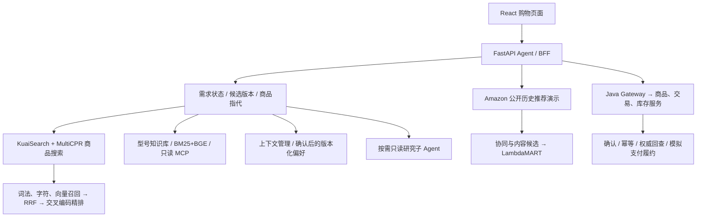

# 电商 Search Agent 与搜索推荐实验：独立审阅纲要

更新日期：2026-09-17。用途：提交给 GPT 或面试准备审阅。内容来自仓库源码、既有实验报告及本日新增训练；除本日行为树模型实验外，不表示本次重新跑过所有历史验收。

公开项目：https://github.com/Osir1603644274/ecommerce-shopping-agent

## 1. 希望解决的问题

在一个购物应用中完成多品类商品搜索、多轮需求修改、证据问答、受控推荐，以及用户确认后的模拟交易。项目目标同时覆盖搜索排序算法、推荐算法和 Search Agent 实习的能力证据。当前不能把不同数据集的商品、用户和监督标签强行合并。

不是所有分支都部署：选定交叉编码模型进入商品搜索；Amazon 树排序进入公开历史推荐演示；KuaiSearch 用户行为排序仍为离线实验。腾讯生成式推荐属于另一个独立项目，不计入本项目已完成成果。

## 2. 系统结构

手机分支具有更多可抽取字段和型号知识；其他品类也支持需求修改和基于已有内容的筛选，但证据与属性不一定齐全。公开数据源商品不能自动获得真实库存和价格；演示模拟值与原始事实区分。

## 3. 数据与任务的分工

| 数据 / 资产 | 用途 | 监督与边界 |
|---|---|---|
| KuaiSearch、MultiCPR 商品记录 | 多品类检索、相关性排序 | 约 763.7 万源记录；不等于去重商品或有标签训练样本数 |
| 自建检索候选池与 qrel | Cross-Encoder 与 LTR 对照 | 人工裁决、模型辅助标签和未判断项分层；开发与历史回归暴露程度需区分 |
| KuaiSearch 曝光、点击与用户历史 | 有 query 的行为排序 | 二元点击；不等于相关性 qrel，缺可靠展示位置和精确反馈到达时间 |
| Amazon Reviews 2018 Luxury Beauty | 无 query 的行为推荐 | 评价 ≥4 作为未来正反馈；不是曝光点击或真实购买日志 |
| 手机知识库 | RAG 证据问答 | 审核 439 件手机型号，425 条事实覆盖 99 个型号；型号规格不等于实物机况 |
| Shopping Companion 衍生受控任务 | 长历史偏好检索与商品匹配 | 40 个任务；衍生背景与原始官方完整历史分清，不声称官方全量复现 |

## 4. 搜索：召回、精排、训练与对照

已实现 BM25、字符二元组、BGE 稠密三路召回，经加权 RRF 合并，使用 bge-reranker-base 交叉编码器精排。采用 LoRA 进行参数适配，使用 pairwise 排序目标训练。

历史材料记录：182 个隔离训练查询、5,823 组有序文档对；固定 Top300 候选，33 条主开发查询 pooled nDCG@10，原始交叉编码器 **0.736 → 0.830**。该结果是开发集精排对照，不代表百万商品全库召回提升或新盲测成绩。本次没有重新复算这组历史指标；面试需核对 33 条总查询与历史性能报告中 29 条可计分查询的具体版本差异。

搜索 LambdaMART 与 CE 排名融合曾在 145 条历史回归查询达到 **0.841 → 0.849**，CE/MART 的加权 RRF 权重为 75/25；历史材料报告配对差值区间 [0.0037, 0.0128]。它是融合候选，不能写成当前应用已切换，也不能将已参与分析的回归集称为独立测试集。此处 RRF 是排名融合，不是直接相加两个原始模型分数。

双编码召回微调亦已执行：66 个查询、324 个 query–正例组合，随机负例和困难负例三种子对照。开发池 Recall@300：原 BGE 0.884153，困难负例均值 0.884339，区间跨 0，故保留原 BGE。存在 73 对新 Top10 未判断项，不能把它们默认为负例或断言新模型真正相关性更差。

工程实现包括 PQ128 候选提议、原向量复核、GPU 模型常驻、FTS5 TopK、并行读取及连接复用。历史 10 条真实入口请求端到端耗时中位数 6.68 秒，包含模型调用；不是当前全场景 SLA，也不是推理服务 P95。本次发布未重新进行服务延迟验收。

## 5. Amazon 推荐：已经训练并接入演示

清洗后 28,879 条评价事件；静态目录 12,111 件商品，不能把目录规模当监督规模。同日行为按无序篮子处理，避免编造日内顺序。

三路 ItemCF / TF-IDF / MiniLM 产生候选，用历史共现、内容、品牌、类目、冷商品和召回排名等 12 项特征训练 LambdaMART。另以 PyTorch 训练无序篮子 ID 与因果篮子 Transformer，使用三种子比较。

| 925 位时间留出用户、1,109 个目标 | nDCG@10 | Recall@100 |
|---|---:|---:|
| 同候选三路 RRF | 0.01953 | 8.36% |
| 同候选 LambdaMART | 0.03014 | 10.59% |
| 无序篮子 ID（3 seed 范围） | 0.02432～0.02581 | 9.25%～10.38% |
| 因果篮子 Transformer（3 seed 范围） | 0.01106～0.01392 | 5.73%～5.88% |

LambdaMART 对 RRF 的 nDCG 差值区间 [0.00376, 0.01808]。同候选指每人 132～292 件，重排再截 Top100，因此 Recall@100 可以改变。最终导出树推理进入受控推荐工具，992 条开发结果与离线结果一致；本地暖调用 P50/P95 为 138.1/162.3 ms，不等于 Agent 全链路或并发容量。

最新诊断：1,109 个真实目标只有 152 个进入候选，957 个未入池；目标级覆盖 13.71%，用户宏平均覆盖 13.32%。冷商品目标 462 个，进入候选 24 个，进 Top10 为 0。说明召回覆盖和冷商品排序都是问题，不能单凭绝对 nDCG 判断“Amazon 数据差”。

进一步只在 992 位开发用户改变召回深度，固定模型：每路 Top100→Top200，池覆盖 20.68%→25.29%，nDCG 0.04110→0.04252；差值区间跨 0。这个开发结果不能与前表 925 位用户结果串成一条提升链；尚未切换应用默认模型。

## 6. KuaiSearch 用户行为排序：2026-09-17 最新完成

固定 20,192 训练请求 / 647,637 曝光、13,481 开发请求 / 448,658 曝光、16,541 历史回归请求 / 494,271 曝光。本轮完成 12 次训练，旧输入哈希、候选标签对齐、分区请求隔离、开发早停选择、独立指标实现均核验。

| 方案（三 seed 均值） | 开发 nDCG@10 | 历史回归 nDCG@10 |
|---|---:|---:|
| 原 MLP，16 特征 | 0.179410 | 0.179567 |
| GBDT/BCE，16 特征 | 0.182376 | 0.179035 |
| LambdaMART，16 特征 | 0.176898 | 0.172026 |
| LambdaMART，无历史 11 特征 | 0.175674 | 0.173158 |
| GBDT/BCE，加近期关系共 23 特征 | 0.183365 | 0.180064 |

新增 7 项特征包括近 20 请求内的商品、品牌、类目点击份额，最近有点击时间组的相应份额及近期点击数。严格使用请求之前历史，不把当前点击当特征。

近期关系对原 GBDT 回归增量约 0.001028，区间 [0.000012, 0.001970]，开发区间仍跨 0；相对原 MLP 增量 0.000497，区间 [-0.001064, 0.001953]。因此保留离线候选，尚未证明总体稳定胜出。当前参数下 LambdaMART 较差，不等于此类算法普遍无效。

本实验全部请求计分，8,085 条零点击请求记 0，理论最高均值约 0.5112；不能与搜索 qrel 的 0.83 横比。公共匿名用户不映射到真实登录用户。下一步待审阅：是否补历史商品与候选的文本/语义匹配，以及如何获得新的未参与选择的评测窗口。

## 7. Agent、记忆、协作与 Java 工程

- LangGraph / TaskState、模型路由和分阶段工作流维护跨轮需求、候选版本、指代、比较与撤销。并非所有商品分支都是同一 ReAct 决策循环。
- Context Pack/View 组织对话与工具证据；历史同一合成会话 48 轮对照 Token 减少 13.81%，四维双评均分最大下降 0.031/4，不能外推所有会话无损。
- 长期偏好经确认进入 MySQL 版本链，Redis 为投影，支持纠正、停用和删除。历史三会话 42 项检查不是算法泛化成功率。
- 证据不足时委派只读研究子 Agent，校验任务版本与候选范围，拒绝过期结果并支持回退；历史 8 个冻结合成案例不是多 Agent 必然优于单 Agent 的证据。
- 只读 MCP 提供商品证据检索；候选池构建 Skill 封装确定性工具，不把工具封装当作新增学习算法。
- Java 17 / Spring Boot / MyBatis 提供商品、订单、库存、模拟支付与履约；JWT、资源归属、确认绑定、幂等、Outbox/Inbox、Kafka 和 UNKNOWN 回查维持交易边界。
- 9 月 15 日报告记录独立搜索、Gateway、双商品/交易实例与独立库存服务的本机验收；不同 schema 共用物理 MySQL，不是生产多机高可用。本次未检查这些服务是否正在运行。

## 8. 请 GPT 重点审阅

1. 依据当前 AI 搜索／推荐实习 JD，分别判断搜索排序、推荐、Search Agent 的能力证据；区分投递必需与可在实习中学习的加分项。
2. 当前应继续改善 KuaiSearch 行为特征、扩充 Amazon 行为与召回、强化双编码监督，还是先投递？只选最高优先级的 1～3 项，给出可验收的完成与停止条件。
3. 审查训练/开发/回归隔离、未判断项、零点击请求、候选覆盖和分母；不要直接比较不同任务的 nDCG。
4. 解释为什么行为 AUC 提升未必带来请求内排序提升；给出能区分模型、特征、目标与数据问题的最小实验。
5. 如何将离线个性化接入真实 Agent，而不伪造用户映射、不把召回等同曝光、不跨数据集冒称端到端统一推荐？
6. 给出简历可保留的 4～6 条成果与对应面试追问；不要编造上线收益，也不要把所有研究负结果都当作项目没有价值。

## 9. 材料索引

- [本轮行为排序](../experiments/behavior-lambdamart-20260917/SUMMARY.md)
- [Amazon 推荐完成报告](../experiments/recommendation-completion-20260916/RESULT.md)
- [Amazon 召回上限诊断](../experiments/recommendation-ceiling-audit-20260917/REPORT.md)
- [Amazon 召回深度对照](../experiments/recommendation-depth-20260917/REPORT.md)
- [BGE 召回训练](../experiments/dense-recall-audit-20260915/RESULT.md)
- [此前行为排序闭环](../experiments/behavior-closeout-20260916/RESULT.md)
- [独立服务发布记录](../architecture/microservices-release-20260915/RELEASE.md)

报告属于项目自有实验记录，不是第三方认证。原始大数据、模型权重、机器凭证和交易快照不随审阅包发布；复现路径写在各报告中。公开源码与历史实验评测时的源码版本不必相同，应按冻结产物辨别。
